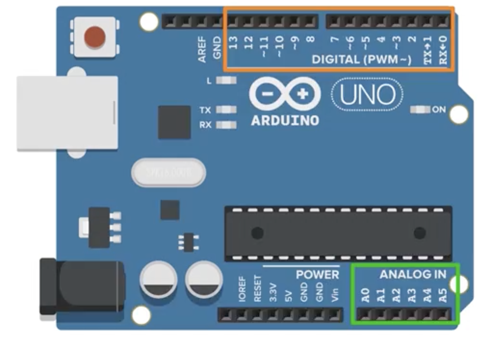
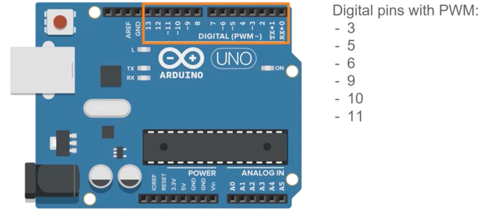
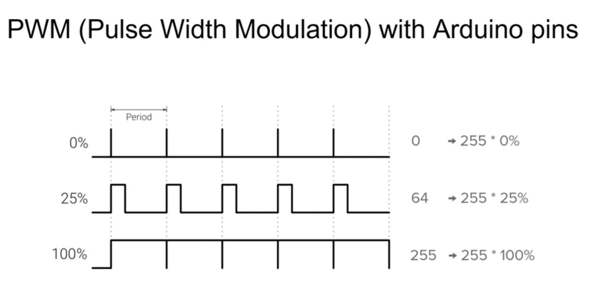
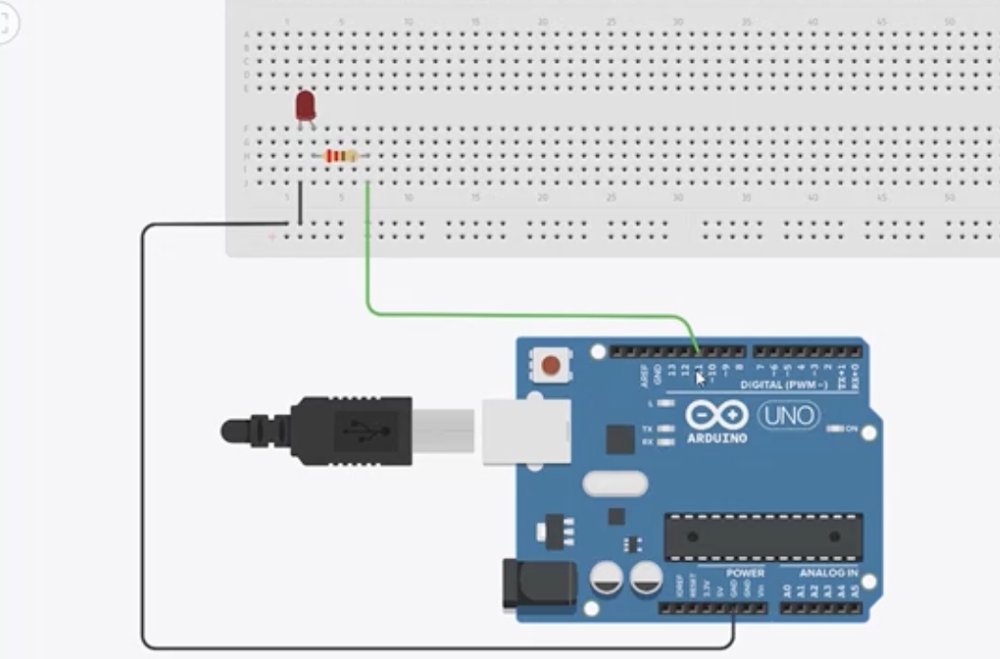

# Arduino Digital Pins Basics

## 🎯 Introduction

To control hardware components like LEDs or read signals from sensors, you use the **pins** on the Arduino board. There are two main types:

* **Digital Pins** (orange in diagrams)
* **Analog Pins** (green in diagrams)

In this section, we focus on **digital pins**.

---

## 🔌 Digital Pins on Arduino

* On the **Arduino Uno**, there are **14 digital pins**, numbered from `0` to `13`.



* Other boards (like Nano, Mega) may have a different layout or number of pins.
* If you understand how they work on the Uno, you can easily adapt to other boards.

---

## ⚡ What Can Digital Pins Do?

Digital pins can be used in **two ways**:

1. **Output Mode** → Send signals to components (e.g., turn an LED on/off).
2. **Input Mode** → Read signals from components (e.g., detect button press).

---

## 🛠️ Setting Pin Mode

Before using a pin, define whether it is an input or output using `pinMode()`.

Example:

```cpp
void setup() {
  pinMode(LED_BUILTIN, OUTPUT); // Set LED pin as output
}
```

---

## 💡 Output States

A digital pin has **two states**:

* `HIGH` → 5V → Turns LED **ON**
* `LOW` → 0V → Turns LED **OFF**

Example:

```cpp
void loop() {
  digitalWrite(LED_BUILTIN, HIGH); // LED ON
  delay(1000);
  digitalWrite(LED_BUILTIN, LOW);  // LED OFF
  delay(1000);
}
```

This makes the LED blink every second.

---

## 📖 Recap – Controlling an LED

To fully control an LED with a digital pin:

### **Step 1 – Define the Pin**

Use `#define` to make your code easier to update later:

```cpp
#define LED_PIN 12
```

### **Step 2 – Set Pin Mode**

Inside `setup()`, configure the pin:

```cpp
void setup() {
  pinMode(LED_PIN, OUTPUT); // Define pin as output
  digitalWrite(LED_PIN, HIGH); // Turn LED on at start
  delay(3000); // Keep it on for 3 seconds
}
```

### **Step 3 – Control the LED in Loop**

Inside `loop()`, toggle the LED state:

```cpp
void loop() {
  digitalWrite(LED_PIN, LOW);  // LED OFF
  delay(500);
  digitalWrite(LED_PIN, HIGH); // LED ON
  delay(500);
}
```

➡️ This program:

1. Turns the LED on for 3 seconds at startup.
2. Then makes it blink ON/OFF every 500 milliseconds.

---

## 🎛️ PWM (Pulse Width Modulation)

So far, we’ve seen digital pins in **binary mode**: either HIGH (5V) or LOW (0V). But some digital pins can do more — they support **PWM** (Pulse Width Modulation).

* On the Arduino Uno, PWM is available on **pins 3, 5, 6, 9, 10, 11** (they are marked with `~`).
* PWM is not truly analog — it’s a digital signal that switches HIGH and LOW very quickly, creating the *illusion* of different voltages.





### **Why use `analogWrite()` on Digital Pins?**

Even though these are called *digital* pins, a subset of them (`3, 5, 6, 9, 10, 11`) can generate PWM signals. Arduino provides the function `analogWrite()` to simplify controlling this PWM output. So, while the pin itself is still digital (HIGH or LOW at any instant), by rapidly switching between HIGH and LOW with varying duty cycles, it simulates analog behavior. That’s why:

* `digitalWrite()` is used for simple ON/OFF control.
* `analogWrite()` is used on PWM-enabled digital pins for brightness/speed control.

Think of it this way:

* **Digital pin without PWM** → only ON or OFF.
* **Digital pin with PWM** → ON/OFF very fast → behaves like adjustable output.

### **Duty Cycle**

The key concept in PWM is the **duty cycle**:

* 0% duty cycle → always LOW (like 0V)
* 100% duty cycle → always HIGH (like 5V)
* 25% duty cycle → HIGH for 25% of the time, LOW for 75% → average ≈ 1.25V

This allows you to **dim LEDs** or **control motor speed** smoothly, instead of just ON/OFF.

---

## 🔢 Using PWM in Arduino

To use PWM, we call `analogWrite()` (only on PWM-capable pins):

```cpp
#define LED_PIN 9

void setup() {
  pinMode(LED_PIN, OUTPUT);
}

void loop() {
  analogWrite(LED_PIN, 64);   // 25% brightness (64/255)
  delay(1000);
  analogWrite(LED_PIN, 127);  // 50% brightness
  delay(1000);
  analogWrite(LED_PIN, 255);  // 100% brightness
  delay(1000);
}
```

### **Explanation**

* `analogWrite(pin, value)` takes a value from **0–255**.

  * `0` = 0% duty cycle = LED OFF
  * `255` = 100% duty cycle = LED fully ON
  * Any number in between adjusts brightness.

---

## 🔌 Circuit Setup for PWM Example

When using `analogWrite()`, you must connect your LED to a PWM-enabled pin (marked with `~`). For example, pin 11 works, but pin 12 does not.

### **Steps to Wire the Circuit**

1. Place the LED on the breadboard.
2. Connect the shorter leg (cathode) to **GND** using a black wire.
3. Connect the longer leg (anode) to a **resistor** (220Ω recommended).
4. Connect the other side of the resistor to **pin 11** with a green wire.

---

## ⚡ Example Code with `analogWrite()`

```cpp
#define LED_PIN 11

void setup() {
  pinMode(LED_PIN, OUTPUT);
  analogWrite(LED_PIN, 20); // ~8% duty cycle → very dim LED
}

void loop() {}
```

➡️ This turns the LED on with low brightness (\~8%).

You can change the brightness by modifying the second parameter:

* `analogWrite(LED_PIN, 200);` → much brighter (\~78%)
* `analogWrite(LED_PIN, 0);`   → LED OFF
* `analogWrite(LED_PIN, 255);` → full brightness




---

## 🌗 Fade In and Fade Out with PWM

PWM allows us not only to set fixed brightness but also to **gradually increase or decrease brightness** — this creates a smooth fade-in and fade-out effect.

### **Fade Code Example**

```cpp
#define LED_PIN 11

void setup() {
  pinMode(LED_PIN, OUTPUT);
}

void loop() {
  // Fade in (0 → 255)
  for (int i = 0; i <= 255; i++) {
    analogWrite(LED_PIN, i);
    delay(5); // controls speed of fade
  }

  // Fade out (255 → 0)
  for (int i = 255; i >= 0; i--) {
    analogWrite(LED_PIN, i);
    delay(5);
  }
}
```

### **Explanation**

* The first `for` loop gradually increases brightness from 0 to 255.
* The second `for` loop decreases brightness back down to 0.
* `delay(5)` gives time between each step so our eyes see it as smooth fading.
* If you decrease the delay, the fade happens faster; increase it, and the fade is slower.

➡️ This technique is useful for:

* Smooth LED effects (like breathing lights).
* Simulating sunrise/sunset.
* Gradual motor speed changes.

---

## 📊 Key Notes

* Always connect LEDs through a resistor to avoid damage.
* Only PWM pins (`3, 5, 6, 9, 10, 11`) support `analogWrite()`.
* PWM simulates analog output but is still digital switching at high speed.
* Brightness/speed is controlled by **duty cycle** (0–100%).
* Fade-in/fade-out is done by gradually changing duty cycle values in a loop.

---

## 📝 Summary

* Arduino Uno has **14 digital pins (0–13)**.
* Digital pins can be **input** (read sensor) or **output** (control component).
* In output mode, pins have **binary states**: `HIGH` (5V) and `LOW` (0V).
* Some pins support **PWM** for analog-like control.
* Use `analogWrite(pin, value)` with values 0–255 to adjust brightness or motor speed.
* Even though `analogWrite()` is used, it still works on **digital PWM pins**, not true analog pins.
* PWM also enables smooth effects like **fade in and fade out** using loops.
