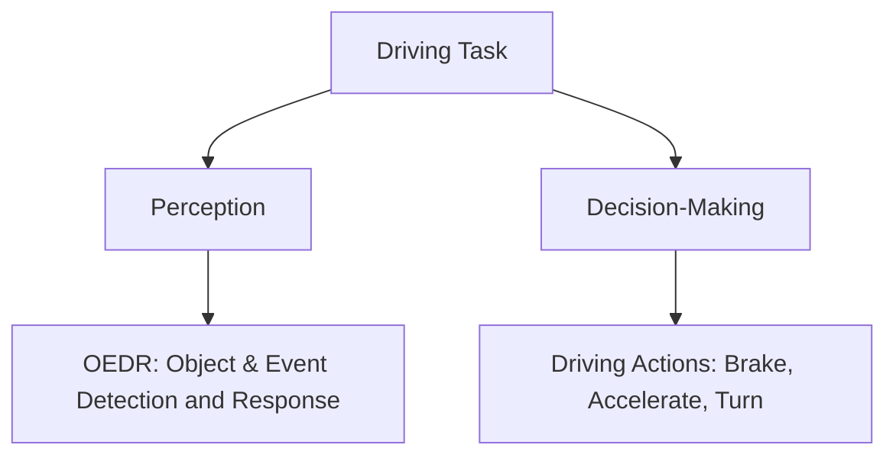
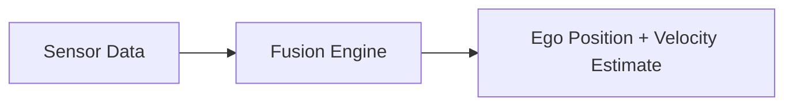

# 📍 Perception in Autonomous Driving

This document explains how autonomous vehicles perceive the world around them — a crucial foundation for making safe and intelligent driving decisions.

---

## 🧠 What is Perception?

Perception is the task of understanding the environment and how the ego vehicle is moving within it.

### Core Functions of Perception:

* **Identify static and dynamic objects**
* **Predict object motion**
* **Estimate the ego vehicle’s position and movement**

---

## 📆 Components of a Driving Task



---

## 🌟 Goals of Perception

### 1. **Identify Static Elements**

| Static Element    | Examples                        |
| ----------------- | ------------------------------- |
| Road Layout       | Lane markings, zebra crossings  |
| Traffic Signals   | Stop lights, pedestrian signals |
| Road Signs        | Speed limit, hospital, school   |
| Off-Road Elements | Curbs, barriers                 |
| Road Obstructions | Cones, construction markers     |


### Road Layout


### Traffic Signals


### Road Signs


### Off-Road Elements


### Road Obstruction


### 2. **Identify Dynamic Elements**

| Type               | Examples            | Challenge Level |
| ------------------ | ------------------- | --------------- |
| Vehicles (4-wheel) | Cars, trucks, buses | Medium          |
| Two-Wheelers       | Bikes, motorcycles  | High            |
| Pedestrians        | Walking individuals | Very High       |

> 🧠 **Note**: Human motion is much more unpredictable than vehicle motion. Dynamic objects are more of moving objects like trucks, pedestrians.

### Vehicles (different types)


### Pedestrians 


---

### 3. **Ego Localization**

 - Understanding where *you* (the car) are and how you're moving:
 - Includes Position, Velocity, Acceleration, Orientation and angular motion

**Data Sources**:

* 📍 GPS
* 🧱 IMU (Inertial Measurement Unit)
* 🛎️ Odometry



---

## ❗ Why Is Perception Hard?

### 🧩 Key Challenges:

1. **Sensor Uncertainty**

   * Noisy GPS, radar, or LIDAR signals.
   * GPS outages in tunnels.

2. **Environmental Conditions**

   * Rain, fog, snow distort sensor readings.
   * Sudden lighting changes or lens flares.
  
   


3. **Occlusion and Reflections**

   * Blocked line of sight.
   * Reflective surfaces confuse detection systems.
   *  

4. **Data Limitations**

   * Training data needed for diverse weather, objects, and environments.
   * Annotation is expensive and slow.
  
5. **Illumination and lens fare**
   
  

---

## 📷 Sensor Redundancy is Key


| Sensor  | Strengths                      | Weaknesses                       |
| ------- | ------------------------------ | -------------------------------- |
| Cameras | High-resolution visual info    | Affected by lighting & weather   |
| LIDAR   | Accurate depth sensing         | Can be blocked or reflected      |
| Radar   | Good in bad weather            | Low resolution                   |
| GPS     | Global positioning             | Can be jammed or blocked indoors |
| IMU     | Measures acceleration/rotation | Drifts over time                 |

> ✅ **Combine sensors for robustness.** Use sensor fusion!

---

## 🧱 Summary

✔️ **Perception = Understand Environment + Self-Motion**
✔️ Identify **static** and **dynamic** elements
✔️ Predict object behavior for better decisions
✔️ Handle uncertainty, occlusion, sensor errors
✔️ Use **multiple sensors** for robustness

---


> “What should the car do next?”


# 🚗 Decision-Making in Autonomous Driving

Welcome to Lesson 3!
This document explores how self-driving cars make decisions. Decision-making is part of **planning**, which comes after **perception** and before **execution**.

---

## 🧠 Driving Task Pipeline

```
Perception → Planning → Execution
```

Within **Planning**, we break decisions into three layers:

* **Mission Planning** (long-term)
* **Behavioral Planning** (short-term)
* **Motion Planning** (immediate)

---

## 🧭 Types of Planning

### 1. Mission Planning (Long-Term)

* Global decisions like: *“How do I get from point A to B?”*
* Example: Drive from New York to Los Angeles

### 2. Behavioral Planning (Short-Term)

* Tactical decisions like: *“Should I turn left here?”*
* Example: Change lanes, prepare for a turn

### 3. Motion Planning (Immediate)

* Real-time control: *“How much to turn the wheel?”*
* Example: Follow the curve, brake gently

---

## 🚦 Example: Left Turn at an Intersection

Let’s walk through a left-turn scenario:

* **Mission Level (Long Term)**: Turn left to get home


* **Behavioral Level (Short Term)**: Move to left-turn lane, slow down (involves lane change, stopping at signals, padestrian etc). 


  
* **Motion Level**: Stop smoothly, steer accurately

> Even a basic turn involves many quick, layered decisions


---

## 🔄 Types of Planning Logic

### Reactive Planning (Rule based reactive Planning) --> takes into account rules and not future predictions

* Responds to *current* conditions only
* Example: “If red light, then stop”
* Example: If the speed limit changes, adjust speed to match it.

Pros:

* Fast and simple

Cons:

* Cannot handle future predictions

---

### Predictive Planning

* Forecasts what *will* happen
* Example: “That car has been stopped for 10 seconds. It’s probably staying stopped for next 10 seconds.”
* Example: Pedestrian is jaywalking. She will enter our lane by the time we reach her.

Pros:

* Human-like, context-aware

Cons:

* Complex, depends on accurate predictions

---

## 🔁 Challenges in Decision-Making

* Unpredictable pedestrians or cyclists
* Incomplete lane markings or signs
* Weather and lighting conditions
* Vehicles behaving erratically

> Self-driving cars must continuously update their plans as new data arrives

---

## ✅ Summary

* Planning includes long-term, short-term, and immediate decisions
* Real-world driving involves many variables and uncertainties
* Reactive and predictive planning serve different use cases

---


The autonomous vehicle (AV) industry is rapidly evolving and aggressively hiring. Whether you're aiming for firmware, perception, planning, or systems engineering, there's a place for you. Here's a curated set of insights and advice from experienced engineers in the field to help you carve your path.

🎓 Education and Foundational Skills

Engineering Degrees Help: A background in engineering, especially from programs like Mechatronics, provides a solid foundation in hardware, software, and systems thinking.

CS Path Is Also Viable: Computer science majors with hands-on experience in embedded systems or hardware integration can also excel.

Hands-On is Key: Take embedded systems courses, robotics electives, or pursue personal projects involving microcontrollers, sensors, or simulators.

🛠️ Build Practical Skills

Firmware & Embedded Systems: Understanding how to actuate physical components is a big plus. Learn low-level programming.

C++ and Python: These are the most critical programming languages in the industry. C++ for performance-critical code and Python for scripting, ML, and glue logic.

Machine Learning & First Principles: Some roles require solving perception/planning problems from scratch using ML, while others need solid physics-based reasoning.

🤖 Project Experience

Join Student Teams: Participate in robotics or autonomous vehicle competitions. This helps develop leadership, collaboration, and communication.

Personal Projects: Build your own "laptop on wheels" or use simulators like CARLA or Gazebo. These projects teach real-world debugging and integration skills.

Mentoring and Community: Mentoring others (e.g. through FIRST Robotics) demonstrates leadership and deepens your own understanding.

📡 Think Systems, Not Silos

Understand the Full Stack: AV systems combine control, perception, planning, hardware, comms, and human-machine interaction.

Don't Just Specialize Too Early: While it's okay to go deep, it's better to also be broad. Know a bit about control, planning, lasers, vision, and hardware.

Collaborate Effectively: You'll be working with experts from various domains, so being able to communicate across disciplines is essential.

🌩 Embrace the Chaos

Real-World Testing: Don’t just run your code indoors. Test in rain, snow, glare, etc. Real-world conditions teach resilience and practical robustness.

Be There When Things Fail: Debugging in the field teaches more than polished demos. Learn how and why systems fail.

🧠 Mindset and Attitude

Be Curious and Excited: Passion for solving hard robotics problems is a huge plus.

Code Like a Pro: Be proud of clean, reliable, maintainable code. Poor code quality leads to poor systems.

Keep Practicing: Always be learning—new libraries, techniques, systems. The field evolves fast.

🏁 Final Thoughts

The AV space is expanding rapidly—every part of the stack needs talent.

Companies like Zoox and others are actively recruiting for firmware, perception, ML, planning, and systems engineering roles.

The industry values people who combine technical depth with cross-domain understanding, resilience, and a willingness to work on messy, real-world problems.

🚗 "Be a proud roboticist. Love the mess. Learn by doing."
