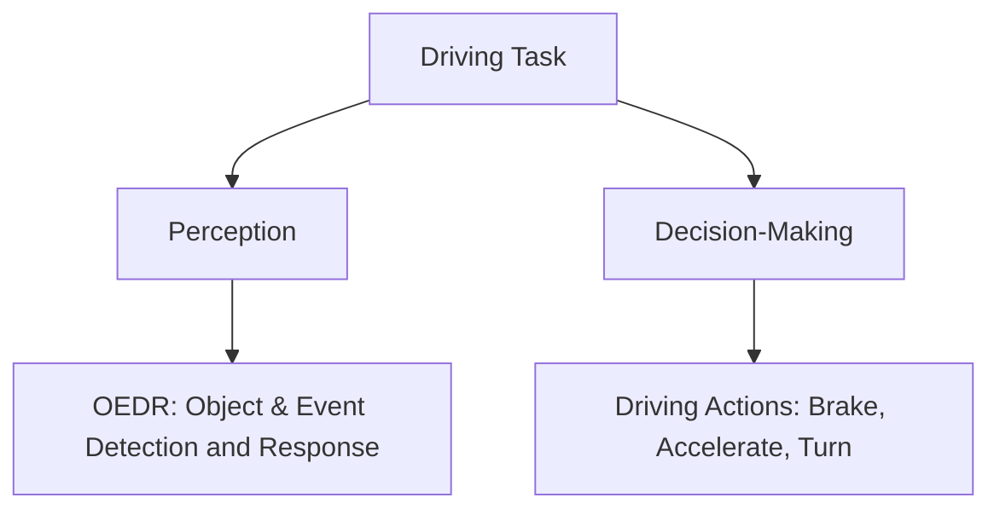
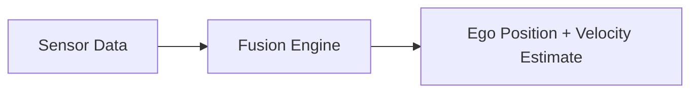

# 📍 Perception in Autonomous Driving

Welcome to Lesson 2!
This document explains how autonomous vehicles perceive the world around them — a crucial foundation for making safe and intelligent driving decisions.

---

## 🧠 What is Perception?

Perception is the task of understanding the environment and how the ego-vehicle is moving within it.

### Core Functions of Perception:

* **Identify static and dynamic objects**
* **Predict object motion**
* **Estimate the ego vehicle’s position and movement**

---

## 📆 Components of a Driving Task

---

## 🌟 Goals of Perception

### 1. **Identify Static Elements**

| Static Element    | Examples                        |
| ----------------- | ------------------------------- |
| Road Layout       | Lane markings, zebra crossings  |
| Traffic Signals   | Stop lights, pedestrian signals |
| Road Signs        | Speed limit, hospital, school   |
| Off-Road Elements | Curbs, barriers                 |
| Road Obstructions | Cones, construction markers     |

### 2. **Identify Dynamic Elements**

| Type               | Examples            | Challenge Level |
| ------------------ | ------------------- | --------------- |
| Vehicles (4-wheel) | Cars, trucks, buses | Medium          |
| Two-Wheelers       | Bikes, motorcycles  | High            |
| Pedestrians        | Walking individuals | Very High       |

> 🧠 **Note**: Human motion is much more unpredictable than vehicle motion.

---

### 3. **Ego Localization**

Understanding where *you* (the car) are and how you're moving:

**Data Sources**:

* 📍 GPS
* 🧱 IMU (Inertial Measurement Unit)
* 🛎️ Odometry

---

## ❗ Why Is Perception Hard?

### 🧩 Key Challenges:

1. **Sensor Uncertainty**

   * Noisy GPS, radar, or LIDAR signals.
   * GPS outages in tunnels.

2. **Environmental Conditions**

   * Rain, fog, snow distort sensor readings.
   * Sudden lighting changes or lens flares.

3. **Occlusion and Reflections**

   * Blocked line of sight.
   * Reflective surfaces confuse detection systems.

4. **Data Limitations**

   * Training data needed for diverse weather, objects, and environments.
   * Annotation is expensive and slow.

---

## 📷 Sensor Redundancy is Key

| Sensor  | Strengths                      | Weaknesses                       |
| ------- | ------------------------------ | -------------------------------- |
| Cameras | High-resolution visual info    | Affected by lighting & weather   |
| LIDAR   | Accurate depth sensing         | Can be blocked or reflected      |
| Radar   | Good in bad weather            | Low resolution                   |
| GPS     | Global positioning             | Can be jammed or blocked indoors |
| IMU     | Measures acceleration/rotation | Drifts over time                 |

> ✅ **Combine sensors for robustness.** Use sensor fusion!

---

## 🧱 Summary

✔️ **Perception = Understand Environment + Self-Motion**
✔️ Identify **static** and **dynamic** elements
✔️ Predict object behavior for better decisions
✔️ Handle uncertainty, occlusion, sensor errors
✔️ Use **multiple sensors** for robustness

---

## 📜 Coming Up Next

In the next lesson, we’ll dive into **Decision Making** for autonomous vehicles — using perception to answer:

> “What should the car do next?”

---

## 🖼️ Suggested Visuals to Add (for presentation or project)

* Diagram of vehicle surrounded by LIDAR, radar, and cameras
* Side-by-side image of a camera vs LIDAR output
* Table comparing pedestrian vs vehicle movement patterns
* Animation showing a car predicting a pedestrian’s trajectory
* Flowchart showing sensor fusion pipeline
