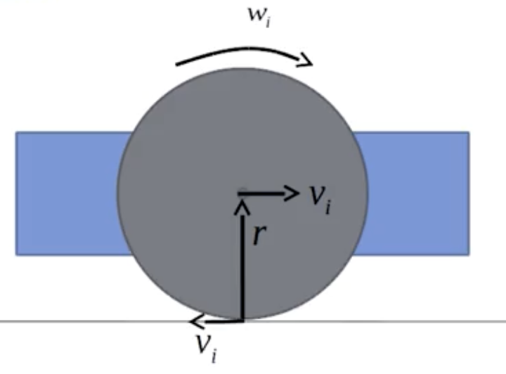

# 📘 Kinematics 101: The Basics Explained Simply

This document is a beginner-friendly guide to understanding kinematics — the science of how things move — using intuitive, real-world language and examples.

---

## 🚀 Kinematics Summary Table (Simplified Style)

| Concept          | What it Tells Me                                                 | Includes                   | Example                                        |
| ---------------- | ---------------------------------------------------------------- | -------------------------- | ---------------------------------------------- |
| **Distance**     | How much total ground I covered                                  | Just amount (no direction) | Walk 5m forward + 3m back = **8m**             |
| **Displacement** | How far I ended up from the starting point and in what direction | Distance + Direction       | Walk 5m forward, 3m back → **+2m** (forward)   |
| **Speed**        | How fast I'm moving (but not where)                              | Only magnitude             | **10 m/s** (no direction)                      |
| **Velocity**     | How fast and where I'm moving                                    | Speed + Direction (vector) | **10 m/s east**, or **−10 m/s** if going back  |
| **Acceleration** | How my velocity is changing over time                            | Change in velocity + time  | Speed goes from 0 to 20 m/s in 4s → **5 m/s²** |

---

## 🧠 Core Concept Flow

We started with:

* **Distance**: Total path covered, no direction.
* **Displacement**: Net change in position — with direction.
* **Speed**: How fast, without direction.
* **Velocity**: Speed + direction.
* **Acceleration**: How fast the velocity is changing over time.
* **Time**: The background for all change. All motion happens over time.

These concepts lead to the development of **Kinematic Equations**, which help us predict:

* Future velocity
* How far an object will move
* How long it takes to stop/start

---

## 📐 First Kinematic Equation

**Equation:** $v = v_0 + at$

**What it means:**

> Current velocity = Initial velocity + (acceleration × time)

**Example:**
A car starts from rest and accelerates at 3 m/s² for 5 seconds:
$v = 0 + 3 \times 5 = 15 \, \text{m/s}$

So, after 5 seconds, the car is moving at 15 m/s.

---

## 🔄 Breaking Velocity into Components Using Angle θ

When a robot or object moves at an angle, its velocity can be split into **horizontal (x)** and **vertical (y)** components using trigonometry.

### 🎯 Goal:

Understand why:
$v_x = v \cdot \cos(\theta), \quad v_y = v \cdot \sin(\theta)$

### 📐 Standard Diagram:

```
             ↑ y-axis
             |
             |      / velocity vector v
             |     /
             |    /
             |   / 
             |  /  
             | /   
             |/θ    
   (origin) *------------------------→ x-axis
```

### 🔍 Explanation:

* The robot moves at speed $v$ at an angle $\theta$ from the x-axis
* You form a **right triangle**:

  * Hypotenuse = total speed $v$
  * Adjacent side = $v_x$ → how much is moving in x-direction
  * Opposite side = $v_y$ → how much is moving in y-direction

### 📏 Use Trigonometry:

* $\cos(\theta) = \frac{v_x}{v} \Rightarrow v_x = v \cdot \cos(\theta)$
* $\sin(\theta) = \frac{v_y}{v} \Rightarrow v_y = v \cdot \sin(\theta)$

### ✅ Final Kinematic Formulas:

$\dot{x} = v \cdot \cos(\theta) \quad \text{(x-direction velocity)}$
$\dot{y} = v \cdot \sin(\theta) \quad \text{(y-direction velocity)}$

### 🧪 Real Example:

If a robot moves at:

* Speed: $v = 10 \, \text{m/s}$
* Angle: $\theta = 60^\circ$

Then:

* $v_x = 10 \cdot \cos(60^\circ) = 5 \, \text{m/s}$
* $v_y = 10 \cdot \sin(60^\circ) \approx 8.66 \, \text{m/s}$

So it moves:

* **5 m/s forward** (x)
* **8.66 m/s upward** (y)

---

## 🔄 Wheel Kinematics: All Differential Drive Scenarios: Complete Guide

This document expands the wheel kinematics by listing **all possible robot motion scenarios** based on left and right wheel speeds, with corresponding formulas, motion types, and examples.

## Two Wheel Kinematic Model


# Differential Drive Kinematics

A comprehensive guide to understanding and implementing differential drive robot kinematics.

## 📖 Overview

Differential drive is a method of controlling a robot using two independently driven wheels. This README explains the mathematical foundations and practical implementation of converting wheel angular velocities to robot motion.

## 🔧 Core Concepts

### Two Types of Angular Velocity (ω)

⚠️ **Important**: There are **two different kinds of ω** used in differential drive:

| Symbol | Meaning | Units | Applies To | Formula Example |
|--------|---------|-------|------------|-----------------|
| ωᵢ | Angular velocity of **a wheel** | rad/s | Individual Wheel | vᵢ = r·ωᵢ |
| ω | Angular velocity of **the robot** | rad/s | Whole Robot (turning) | ω = (vᵣ - vₗ)/L |

## 🧮 Mathematical Derivation

### Step 1: Start with Angular Velocity of Each Wheel

- **ωₗ**: Angular velocity of **left** wheel (spin rate, rad/s)
- **ωᵣ**: Angular velocity of **right** wheel (spin rate, rad/s)

🟢 This is **how fast the wheels spin** — not how the robot turns.

### Step 2: Convert to Linear Speed of Wheels

Using the wheel radius `r`:

```
vₗ = r · ωₗ    (left wheel linear speed)
vᵣ = r · ωᵣ    (right wheel linear speed)
```

🟢 This tells how fast the **wheel is pushing the robot forward**.

Linear velocity is the speed of the car (or robot) moving forward in a straight line. When people say “velocity,” they’re talking about linear velocity — the speed at which something moves forward.

### Step 3: Compute Robot's Motion

#### a. Forward Velocity `v` of the robot (center point) - forward velocity of a two-wheeled robot is the average of the left and right wheel speeds.:
```
v = (vᵣ + vₗ) / 2
```
This is how fast the robot is going **straight ahead** (on average).

- when vr and vl is same, it moves in same direction
- If the wheel velocities are different, the robot moves in a curved path about some instantaneous center of rotation or ICR.

#### b. Angular Velocity `ω` of the robot:
```
ω = (vᵣ - vₗ) / L
```

Where:
- **L** = distance between the two wheels (wheelbase width)
- **ω** = how fast the robot is **turning** (left/right)
- If l is the distance from the center of the robot to one wheel, → then the total wheelbase is 2𝑙
If 𝐿 is the distance from left wheel to right wheel,→ then 𝐿 = 2𝑙
- vr = r.wr and vl=r.wl
- If both wheels move at the same speed, then vr = vl then w = 0 (no turning)

| $\omega$ Value        | What Happens                     |
| --------------------- | -------------------------------- |
| $\omega = 0$          | No turning → robot goes straight |
| $\omega = 0.5$ rad/s  | Gentle turn                      |
| $\omega = 2.0$ rad/s  | Sharp, fast turn                 |
| $\omega = -1.0$ rad/s | Turning right (clockwise)        |


## 🎯 Turning Logic

| Condition | Result | Description |
|-----------|--------|-------------|
| vᵣ = vₗ | **Straight motion** | 🟢 No turning |
| vᵣ > vₗ | **Left turn** | 🟡 Right wheel faster |
| vᵣ < vₗ | **Right turn** | 🔴 Left wheel faster |
| vᵣ = -vₗ | **Spin in place** | 🔁 Wheels rotating opposite directions |

## 🚗 Analogy

Think of this like a car:
- **Wheels spin** (ωᵢ) to move the car forward
- **The car turns** (ω) when left/right wheels move at different speeds

## 🔍 Detailed Breakdown

### 1. **ωᵢ** — Wheel Angular Velocity
- How fast a wheel is **spinning around its axle**
- Think of it like a car tire rotating
- `v = r·ωᵢ`: how fast that spin pushes the robot forward
- ➡️ Used to calculate **forward movement** of each wheel

### 2. **ω** — Robot's Angular Velocity (Turning Rate)
- How fast the **robot is rotating** (like turning left or right)
- Entire robot's turning speed around a point (the ICR - Instantaneous Center of Rotation)
- `ω = (vᵣ - vₗ)/L`: difference in wheel speeds creates turning motion
- ➡️ Used to calculate **turning motion** of robot's body

## 🎓 Applications

This kinematic model is fundamental for:

- **Forward Kinematics**: Given wheel speeds → predict robot motion
- **Inverse Kinematics**: Want robot motion → calculate needed wheel speeds  
- **Odometry**: Track where robot has moved
- **Path Planning**: Control robot to follow desired trajectories
- **Navigation**: Real-time motion control and localization

## 📊 Parameters

| Variable | Description | Units |
|----------|-------------|-------|
| ωₗ, ωᵣ | Wheel angular velocities | rad/s |
| vₗ, vᵣ | Wheel linear velocities | m/s |
| v | Robot forward velocity | m/s |
| ω | Robot angular velocity | rad/s |
| r | Wheel radius | m |
| L | Wheelbase (distance between wheels) | m |

## 🚀 Quick Start

```python
# Example calculation
r = 0.05        # wheel radius (5cm)
L = 0.20        # wheelbase (20cm)
omega_left = 10  # left wheel: 10 rad/s
omega_right = 8  # right wheel: 8 rad/s

# Calculate wheel speeds
v_left = r * omega_left   # 0.5 m/s
v_right = r * omega_right # 0.4 m/s

# Calculate robot motion
v_robot = (v_right + v_left) / 2      # 0.45 m/s forward
omega_robot = (v_right - v_left) / L  # -0.5 rad/s (turning right)
```

## 📝 Notes

- This model assumes no wheel slippage
- Wheels are assumed to be rigid and maintain contact with the ground
- The robot is assumed to be a rigid body
- All motion occurs in a 2D plane


## 📚 Core Variables

* $v_l$: Left wheel velocity
* $v_r$: Right wheel velocity
* $L$: Distance between wheels
* $R$: Turning radius
* $\omega$: Angular velocity (rotation rate)

---

## ✅ General Formulas


## 🔄 Turning Radius $R$ in Differential Drive Robots

The **turning radius $R$** tells us how sharply the robot is turning — it's the distance from the robot’s center to the **Instantaneous Center of Rotation (ICR)**.

---

### 📀 Formula:

$$
R = \frac{L}{2} \cdot \frac{v_r + v_l}{v_r - v_l}
$$

Where:

* $R$: Turning radius (meters)
* $L$: Distance between the two wheels (wheelbase)
* $v_r$: Right wheel’s linear speed (m/s)
* $v_l$: Left wheel’s linear speed (m/s)

---

### 🧠 Intuition:

| Wheel Speeds | Turning Radius $R$             | What It Means        |
| ------------ | ------------------------------ | -------------------- |
| $v_r = v_l$  | $R = \infty$                   | Straight line motion |
| $v_r > v_l$  | $R > 0$ (positive, left turn)  | Robot turns left     |
| $v_r < v_l$  | $R < 0$ (negative, right turn) | Robot turns right    |
| $v_r = -v_l$ | $R = 0$                        | Spins in place       |

---

### 🔢 Example Calculation:

Let:

* $v_r = 1.2 \, \text{m/s}$
* $v_l = 0.8 \, \text{m/s}$
* $L = 0.5 \, \text{m}$

Then:

$$
R = \frac{0.5}{2} \cdot \frac{1.2 + 0.8}{1.2 - 0.8}
= 0.25 \cdot \frac{2.0}{0.4}
= 0.25 \cdot 5
= 1.25 \, \text{meters}
$$

👉 The robot turns **left** in a circle with radius **1.25 meters**

---

### 💡 Summary:

* **Smaller $R$** → tighter curve
* **Larger $R$** → gentler curve
* **$R = 0$** → spin in place
* **$R = \infty$** → straight motion

Use this formula to estimate how sharply your robot is turning during movement!

---

### 💡 Summary:

- **Smaller \( R \)** → tighter curve
- **Larger \( R \)** → gentler curve
- **\( R = 0 \)** → spin in place
- **\( R = \infty \)** → straight motion

Use this formula to estimate how sharply your robot is turning during movement!


---

## 🔁 All Scenarios Table

| Case                        | $v_r$ | $v_l$ | $v_r - v_l$ | $R$   | $\omega$ (angular velocity of robot)  | Motion Type          |
| --------------------------- | ----- | ----- | ----------- | ----- | ---------- | -------------------- |
| 1. Straight Line            | 2.0   | 2.0   | 0           | ∞     | 0          | Forward              |
| 2. Slight Left Turn         | 2.0   | 1.9   | 0.1         | 5.0   | 0.33 / L   | Gentle curve left    |
| 3. Medium Left Turn         | 2.0   | 1.0   | 1.0         | 0.45  | 3.33 / L   | Normal left curve    |
| 4. Sharp Left (spin edge)   | 2.0   | 0.0   | 2.0         | 0.225 | 6.67 / L   | Tight left circle    |
| 5. Spin in Place Left       | 2.0   | -2.0  | 4.0         | 0     | 13.33 / L  | Rotate left on spot  |
| 6. Medium Right Turn        | 1.0   | 2.0   | -1.0        | 0.45  | -3.33 / L  | Normal right curve   |
| 7. Sharp Right Turn         | 0.0   | 2.0   | -2.0        | 0.225 | -6.67 / L  | Tight right circle   |
| 8. Spin in Place Right      | -2.0  | 2.0   | -4.0        | 0     | -13.33 / L | Rotate right on spot |
| 9. Reverse Straight         | -2.0  | -2.0  | 0           | ∞     | 0          | Reverse straight     |
| 10. Reverse Left Turn       | -1.0  | -2.0  | 1.0         | 0.45  | 3.33 / L   | Backward left curve  |
| 11. Reverse Right Turn      | -2.0  | -1.0  | -1.0        | 0.45  | -3.33 / L  | Backward right curve |
| 12. One Wheel Stopped Left  | 2.0   | 0.0   | 2.0         | 0.225 | 6.67 / L   | Pivot around left    |
| 13. One Wheel Stopped Right | 0.0   | 2.0   | -2.0        | 0.225 | -6.67 / L  | Pivot around right   |

**Assumptions for calculations**:

* $L = 0.3$ m
* Sample values show patterns; scale accordingly

---

## 🧠 Notes

* $R = 0$ → Spins in place
* Large $R$ → Gentle curves
* $\omega > 0$: Counterclockwise (left)
* $\omega < 0$: Clockwise (right)

This table is a complete cheat sheet for analyzing and simulating two-wheel robot motion using only wheel speed values!


# Final Summary (Another way to express with angular velocity rather than linear velocity):

# 🤖 Differential Drive Robot: Kinematic Model (Continuous Time)

This document explains how a two-wheeled robot moves using a continuous time kinematic model.

---

## 🧮 Key Formulas

### 1. Forward Linear Velocity (v)

```
      v = (r * w1 + r * w2) / 2
```

* Average of left and right wheel speeds (converted to linear form). same as what we discussed above but we discussed it in linear velocity way (r*wl is vl).

### 2. Angular Velocity (omega)

```
      ω = (r * w1 - r * w2) / (2 * l)
```

* Tells how fast robot rotates (left/right). This is same (vr - vl)/L
* If w1 = w2 → ω = 0 → straight motion

### 3. Robot Motion in 2D

```
      dx/dt = v * cos(θ) = ((r * w1 + r * w2)/2) * cos(θ)
      dy/dt = v * sin(θ) = ((r * w1 + r * w2)/2) * sin(θ)
      dθ/dt = ω = (r * w1 - r * w2)/(2l)
```

* Describes position and heading change over time.

---

## 📐 ASCII Diagram

```
               ^ y
               |
               |
               |        (theta)
               |       ↗
               |     ↗ robot path
               |
(origin) *-------------------------> x

         ← w2                  w1 →
      [O]========================[O]
            |<---- 2l ---->|
                   p (center)
```

---

## 🧠 Interpretations

| Wheel Speeds | Robot Behavior           | omega | Path Type     |
| ------------ | ------------------------ | ----- | ------------- |
| w1 = w2      | Goes straight            | 0     | Straight line |
| w1 > w2      | Turns left               | >0    | Left circle   |
| w1 < w2      | Turns right              | <0    | Right circle  |
| w1 = -w2     | Spins in place           | High  | In-place spin |
| w1 = 0       | Spins around right wheel | med   | Pivot left    |
| w2 = 0       | Spins around left wheel  | med   | Pivot right   |

---

## 📌 Variables

| Symbol | Meaning                          |
| ------ | -------------------------------- |
| r      | Wheel radius                     |
| w1     | Angular velocity of right wheel  |
| w2     | Angular velocity of left wheel   |
| l      | Half the distance between wheels |
| θ      | Orientation of robot             |
| x, y   | Robot's position in world frame  |

---

## 💬 Summary

The continuous time model helps describe how a differential drive robot moves based on:

* **How fast the wheels spin** (w1, w2)
* **The wheel radius** (r)
* **The wheel separation** (2l)

These equations let us simulate and control the robot's position and heading over time using just motor inputs!

> Perfect for building your own robot navigation or controller system.


# Coordinate Frames


Coordinate frames are the foundation of how robots, cars, drones, and satellites understand **where things are**. They act like lenses or viewpoints through which positions, directions, and motions are described.

---

## 📍 What is a Coordinate Frame?

A **coordinate frame** is simply a reference system with an origin and axes (X, Y, Z) that helps describe the position and orientation of objects in space.

Imagine putting a camera at different places:

* One on a car roof
* One on the wall of a building
* One on a satellite
  Each of these views the world differently. These are **different frames**.

---

## 🧭 Main Coordinate Frames

| Frame        | Fixed or Moving? | Attached To             | Used For                                     | Example                                            |
| ------------ | ---------------- | ----------------------- | -------------------------------------------- | -------------------------------------------------- |
| **Inertial** | ❌ Fixed          | Earth or background map | Global positioning, reference for all motion | GPS map, airport control tower                     |
| **Body**     | ✅ Moving         | The vehicle's center    | Describes vehicle's motion                   | Car center, drone center, satellite body           |
| **Sensor**   | ✅ Moving         | Specific sensor device  | Describes what sensor sees                   | Front camera, LIDAR on drone, antenna on satellite |

---

## 📌 Real-World Examples

### 🚗 Self-Driving Car

* **Inertial Frame**: Google Maps coordinate (East-North-Up)
* **Body Frame**: Center of the car (rear axle)
* **Sensor Frame**: Front camera or LIDAR

> Car detects a stop sign 10m ahead (in camera frame)
> It must translate that into global coordinates using body and inertial frames

### 🛰 Satellite

* **Inertial Frame**: Earth-Centered, Earth-Fixed (ECEF)
* **Body Frame**: Center of satellite
* **Sensor Frame**: Camera or antenna mounted on panel

> Satellite needs to point its camera at a city on Earth. It must transform coordinates from its own rotating body to the fixed Earth frame.

### 🚁 Helicopter

* **Inertial Frame**: Ground or GPS frame
* **Body Frame**: Center of gravity of helicopter
* **Sensor Frame**: Infrared camera under the cockpit

> A surveillance camera detects a vehicle. To follow it, the pilot needs to convert camera frame → helicopter frame → Earth frame.

### 🚀 Flying Car (Autonomous Drone-Car Hybrid)

* **Inertial Frame**: Fixed ground map
* **Body Frame**: Center of the drone-car
* **Sensor Frame**: Underbelly LIDAR for landing

> During landing, the LIDAR detects a flat surface. To land safely, the vehicle must calculate where that surface is in global coordinates.

---

## 🔁 Why Do We Need Multiple Frames?

Because sensors are not always in the center, and the vehicle is always moving!

### Scenario:

```
                [ Front Camera ]
                     |
        <--  Car Body Frame  -->
                     |
               [ Rear Wheels ]
```

* A pedestrian is detected by the front camera (sensor frame)
* But the controller needs to plan braking using the car's center (body frame)
* And show the location on the map (inertial frame)

So we must convert:

```
Sensor Frame ➡ Body Frame ➡ Inertial Frame
```

---

## 🧠 What to Remember

* **Inertial frame** = Fixed world view (e.g., Earth, map)
* **Body frame** = Attached to the moving robot/vehicle
* **Sensor frame** = Attached to each device (camera, radar, GPS)
* You must **transform** positions and velocities between frames to make sense of the world

## Complete Guide to Coordinate Transformations
*From Theory to Real-World Applications*

Understanding how to convert between different coordinate systems is fundamental in robotics, computer graphics, navigation, and many other fields. This guide provides both the mathematical foundation and intuitive examples to make these concepts stick.

## 🎯 The Core Problem

When objects exist in the real world, we often need to describe their positions from different perspectives:
- **Global perspective**: "Where is it on the map?" (Inertial/World frame)
- **Local perspective**: "Where is it relative to me?" (Body/Local frame)

Converting between these perspectives requires **coordinate transformation**.

---

## 📚 Mathematical Foundation: The Complete Example

Let's work through a detailed example with a car and an obstacle.

### 🚗 The Setup

**Car's position**: The car is located at **(6, 4)** in world coordinates
- 6 meters East from the world origin
- 4 meters North from the world origin

**Inertial frame origin**: The world coordinate system has its origin at **(0, 0)**
- X-axis points East
- Y-axis points North  
- This is our fixed reference frame

**Car's heading**: The car is facing **30 degrees**
- ⚠️ **Important**: This 30° is measured **counterclockwise from the East direction** (the inertial frame's X-axis)
- So the car is pointing Northeast, not due East

### 🧮 Step 1: Calculate the Rotation Matrix

Since the car is rotated 30° from the inertial frame's orientation, we need the rotation matrix:

**θ = 30° = 0.524 radians**

The rotation matrix from body frame to inertial frame is:
```
R = [cos(θ)  -sin(θ)]
    [sin(θ)   cos(θ)]

R = [cos(30°)  -sin(30°)]
    [sin(30°)   cos(30°)]

R = [0.866  -0.5 ]
    [0.5    0.866]
```

**What this matrix means**: 
- It converts directions from "car's perspective" to "world's perspective"
- Car's forward direction (1,0) becomes (0.866, 0.5) in world coordinates
- Car's left direction (0,1) becomes (-0.5, 0.866) in world coordinates

### 🎯 Step 2: Set Up the Object Position

**Object relative to car**: There's an obstacle at **(3, 1)** in the car's body frame
- 3 meters forward (along car's X-axis)
- 1 meter to the left (along car's Y-axis)

### 🔄 Step 3: Apply the Rotation

First, we rotate the object's position from car coordinates to world orientation:

**Rotated position = R × Object_body**
```
[0.866  -0.5 ] × [3] = [0.866×3 + (-0.5)×1] = [2.598 - 0.5  ] = [2.098]
[0.5    0.866]   [1]   [0.5×3 + 0.866×1  ]   [1.5 + 0.866]   [2.366]
```

**What happened**: 
- The object's position (3,1) relative to the car 
- Becomes (2.098, 2.366) when expressed in world directions
- But this is still relative to wherever the car is!

### 📍 Step 4: Apply the Translation

Now we add the car's world position to get the final answer:

**Final position = Car's world position + Rotated object position**
```
Object_world = [6] + [2.098] = [8.098]
               [4]   [2.366]   [6.366]
```

### 🎉 Final Answer

**The obstacle is located at (8.098, 6.366) in world coordinates**

**Physical meaning**:
- 8.098 meters East from the world origin (0,0)
- 6.366 meters North from the world origin (0,0)

### 🔍 Why Both Steps Were Necessary

**Without rotation** (just adding positions): 
- We'd get (6+3, 4+1) = (9, 7) 
- **Wrong!** This assumes the car faces due East

**Without translation** (just rotation):
- We'd get (2.098, 2.366)
- **Wrong!** This assumes the car is at the world origin

**With both**: We correctly account for the car being at (6,4) AND facing 30° from East direction, giving us the accurate world position of the obstacle at (8.098, 6.366).

---

## 🌍 Real-World Applications: 5 Intuitive Examples

### 🎮 Example 1: Video Game Character

**Scenario**: You're playing a top-down RPG exploring a dungeon.

**Setup**:
- **World frame**: Game map with fixed North/South/East/West directions
- **Character position**: Hero at tile (8, 5) on the map
- **Character facing**: Northeast (45°)
- **Enemy spotted**: Goblin 4 tiles forward, 2 tiles to the right

**Math**:
- Translation: [8, 5] (hero's map position)
- Rotation: 45° from East
- Goblin relative: [4, 2] (4 forward, 2 right)

**Result**: Goblin at tile (10, 8) on the game map!

---

### 📸 Example 2: Wedding Photographer

**Scenario**: Directing your assistant to place lighting equipment.

**Setup**:
- **World frame**: Reception hall with fixed walls
- **Your position**: 15 feet from West wall, 10 feet from South wall
- **Your facing**: 60° toward the dance floor
- **Light placement**: 8 feet in front, 3 feet to your left

**Math**:
- Translation: [15, 10] (your position from SW corner)
- Rotation: 60° from East wall
- Light relative: [8, 3] (8 forward, 3 left)

**Result**: "Place the light 19 feet from West wall, 17 feet from South wall!"

---

### 🤖 Example 3: Robot Vacuum

**Scenario**: Roomba detects a dirty spot while cleaning.

**Setup**:
- **World frame**: Living room with fixed walls
- **Roomba position**: (3.2, 1.8) meters from corner
- **Roomba orientation**: 120° (spun around while cleaning)
- **Dirty spot**: 0.5m ahead, 0.2m to the right

**Math**:
- Translation: [3.2, 1.8] (Roomba's room position)
- Rotation: 120° from room's reference
- Spot relative: [0.5, -0.2] (0.5 ahead, 0.2 right)

**Result**: Dirty spot marked at (2.95, 2.23) for future cleaning!

---

### 🚁 Example 4: Drone Delivery

**Scenario**: Delivery drone spots the target landing zone.

**Setup**:
- **World frame**: GPS coordinates with North/East directions
- **Drone position**: (200, 150) meters from reference point
- **Drone heading**: 330° (30° West of North)
- **Landing zone**: 50m ahead, 10m to the right

**Math**:
- Translation: [200, 150] (drone's world position)
- Rotation: 330° from East
- Target relative: [50, -10] (50 forward, 10 right)

**Result**: Package drop coordinates: (156.7, 193.3)!

---

### 🎯 Example 5: Security Camera

**Scenario**: Mall security tracking a suspicious person.

**Setup**:
- **World frame**: Mall floor plan with fixed store layout
- **Camera position**: (25, 12) meters from main entrance
- **Camera angle**: 45° clockwise from main corridor
- **Person detected**: 8m forward, 3m left of camera center

**Math**:
- Translation: [25, 12] (camera's mall position)
- Rotation: -45° (clockwise from corridor)
- Person relative: [8, 3] (8 forward, 3 left)

**Result**: Person located at (22.5, 16.9) - near Store C!

---

## 🧠 The Universal Pattern

Every coordinate transformation follows the same pattern:

### The Setup Components:
1. **Observer Position** (Translation vector)
2. **Observer Orientation** (Rotation matrix)
3. **Object Relative Position** (Body frame coordinates)

### The Magic Formula:
```
Real_World_Position = Observer_Position + Rotation_Matrix × Relative_Position
```

### Memory Trick: "Where + Which Way"
- **Where** = Translation (Where is the observer?)
- **Which Way** = Rotation (Which way is the observer facing?)

## 🔧 Implementation Template

```python
import numpy as np

def transform_to_world(observer_pos, observer_angle, relative_pos):
    """
    Transform coordinates from local frame to world frame
    
    Args:
        observer_pos: [x, y] position of observer in world
        observer_angle: angle of observer in degrees (CCW from East)
        relative_pos: [x, y] position relative to observer
    
    Returns:
        [x, y] position in world coordinates
    """
    # Convert angle to radians
    theta = np.radians(observer_angle)
    
    # Create rotation matrix
    R = np.array([[np.cos(theta), -np.sin(theta)],
                  [np.sin(theta),  np.cos(theta)]])
    
    # Apply transformation
    rotated_pos = R @ relative_pos
    world_pos = observer_pos + rotated_pos
    
    return world_pos

# Example usage:
car_position = np.array([6, 4])
car_heading = 30  # degrees
obstacle_relative = np.array([3, 1])

obstacle_world = transform_to_world(car_position, car_heading, obstacle_relative)
print(f"Obstacle at: {obstacle_world}")  # [8.098, 6.366]
```

## 🚨 Common Pitfalls

### ❌ Mistake 1: Forgetting Rotation
```python
# Wrong: Just adding positions
wrong_result = observer_pos + relative_pos
```

### ❌ Mistake 2: Wrong Order
```python
# Wrong: Translating then rotating
wrong_result = R @ (observer_pos + relative_pos)
```

### ❌ Mistake 3: Incorrect Angle Convention
```python
# Make sure you know: Is 0° East? North? Clockwise or counterclockwise?
```

### ✅ Correct Approach
```python
# Right: Rotate first, then translate
correct_result = observer_pos + (R @ relative_pos)
```

## 🎯 Key Takeaways

1. **Coordinate transformations are everywhere**: From video games to GPS to robotics
2. **Two components always needed**: Translation (where) + Rotation (which way)
3. **Order matters**: Always rotate first, then translate
4. **Same math, different applications**: The formula never changes, only the context
5. **Think "Where + Which Way"**: This mental model works for any scenario

## 🚀 Next Steps

- **3D Transformations**: Extend to 3D with rotation matrices or quaternions
- **Homogeneous Coordinates**: Learn about 4×4 transformation matrices
- **Inverse Transformations**: Converting from world back to local coordinates
- **Chain Transformations**: Multiple coordinate systems linked together
- **Applications**: Explore robotics SLAM, computer graphics, or game development

---

*This transformation is the foundation of how autonomous vehicles navigate, robots map their environment, and GPS systems work. Master this concept, and you'll understand a fundamental building block of modern technology!*


# 🤖 Robot Kinematics: Holonomic vs. Nonholonomic, Tangents, and Trigonometry

A complete beginner-to-pro guide on understanding how robots move, what it means to be nonholonomic, how velocity splits into components, and why robots can’t just "go left." Includes visual explanations, real-life analogies, and math that actually makes sense.

---

## 🚘 Part 1: What is Nonholonomic Motion?

### 🔍 Simple Explanation

A **nonholonomic** robot (like a car) **cannot move sideways**. It:

* ✅ Can go forward/backward
* ✅ Can turn left/right while moving
* ❌ Cannot slide left/right like a crab

### 🧠 Real-World Analogy

* Car: You can drive forward/backward, but can't strafe left.
* If you want to go left, you **turn the wheel and curve left** — not jump sideways.

### ❌ No Sideways Motion

| Motion            | Allowed? |
| ----------------- | -------- |
| Forward           | ✅        |
| Backward          | ✅        |
| Turn While Moving | ✅        |
| Slide Sideways    | ❌        |

### 🎓 Technical Definition

A **nonholonomic system** has constraints on its **velocity**, not just position.

**Equation:**

```math
\dot{y} \cos(\theta) - \dot{x} \sin(\theta) = 0
```

This equation says: the robot **cannot have motion perpendicular to its heading**.

---

## 🎯 Part 2: Why the Path is Curved

Because the robot cannot move sideways, it must **steer and move forward** to reach a new position. This creates a **curved path**.

If a robot wants to reach a point to its left:

* ❌ It can’t go directly
* ✅ It must turn and **move in a curve**

> The red dashed line in diagrams represents this curved path.

---


## 📐 Part 3: Velocity Components — Sine & Cosine

When a robot moves at an angle $\theta$, its velocity splits into:

* Horizontal part (x-axis): $\dot{x} = v \cdot \cos(\theta)$
* Vertical part (y-axis): $\dot{y} = v \cdot \sin(\theta)$

### 🎓 What This Means

We are calculating:

* How much the robot moves **right** ($x$)
* How much it moves **upward** ($y$)

### 🧪 Example

Robot is moving at:

* Speed: $v = 10 \text{ m/s}$
* Angle: $\theta = 60^\circ$

Then:

```math
\dot{x} = 10 \cdot \cos(60^\circ) = 5 \ \text{m/s} 
\dot{y} = 10 \cdot \sin(60^\circ) \approx 8.66 \ \text{m/s}
```

So it moves:

* 5 m/s in the x-direction (right)
* 8.66 m/s in the y-direction (up)

> This is how the robot moves in the world — forward in its own direction, but seen as x/y in global coordinates.

---

## 🚁 Part 4: Holonomic vs. Nonholonomic Robots

| Feature                     | Holonomic (Drone)       | Nonholonomic (Car)   |
| --------------------------- | ----------------------- | -------------------- |
| Move in any direction?      | ✅ Yes                   | ❌ No                 |
| Move sideways (left/right)? | ✅ Yes                   | ❌ No                 |
| Rotate in place?            | ✅ Yes                   | ❌ Not always         |
| Needs steering to turn?     | ❌ No                    | ✅ Yes                |
| Examples                    | Drone, omni-wheel robot | Car, Roomba, bicycle |

### 📌 Key Difference

* **Holonomic**: Can go in any direction at any time
* **Nonholonomic**: Must move forward/backward and turn gradually

---

## 📊 Part 5: Connecting Everything

### The Robot’s Motion is:

```math
\dot{x} = v \cdot \cos(\theta)
\dot{y} = v \cdot \sin(\theta)
```

To understand how it moves in x and y coordinates.

### ❌ Sideways = Forbidden

Any sideways movement would break the constraint:

```math
\dot{y} \cos(\theta) - \dot{x} \sin(\theta) = 0
```

Which means: the robot can only move in its heading direction.

---

## 📦 TL;DR Summary

* 🚗 **Nonholonomic** = Like a car. Can’t move sideways.
* ✈️ **Holonomic** = Like a drone. Can move in all directions.
* 📐 Use sine/cosine to calculate how the robot moves in x and y.
* 📏 Motion is always **tangent to the path** — not jumping sideways.
* 🧮 Formula to remember:

```math
\dot{x} = v \cos(\theta), \quad \dot{y} = v \sin(\theta)
```

---

## 🛠️ Suggested Visuals

* A diagram showing tangent velocity vector
* Comparison of holonomic vs. nonholonomic paths in a grid
* Triangle showing \$v\$, \$\dot{x}\$, \$\dot{y}\$ with angle \$\theta\$

---

## 📚 Bonus Real-Life Analogy Table

| System         | Holonomic? | Can Slide? | Can Rotate in Place?  | Turns by Curving? |
| -------------- | ---------- | ---------- | --------------------- | ----------------- |
| Car            | ❌ No       | ❌ No       | ❌ Not easily          | ✅ Yes             |
| Drone          | ✅ Yes      | ✅ Yes      | ✅ Yes                 | ❌ Doesn’t need    |
| Roomba Robot   | ❌ No       | ❌ No       | ✅ Yes (spin in place) | ✅ Yes             |
| Omni-Wheel Bot | ✅ Yes      | ✅ Yes      | ✅ Yes                 | ❌ Doesn’t need    |

---

## 📥 Next Steps

You can now:

* Simulate robot movement using these formulas
* Plan curved paths for differential-drive robots
* Understand when to use sine/cosine in robot control
* Distinguish between different types of motion constraints

> Ready to move on to wheel kinematics or full robot control systems? Let’s go! 🚀
