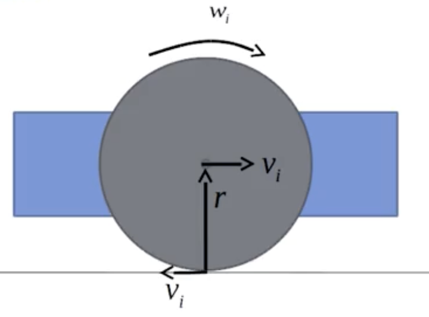

# 📘 Kinematics 101: The Basics Explained Simply

This document is a beginner-friendly guide to understanding kinematics — the science of how things move — using intuitive, real-world language and examples.

---

## 🚀 Kinematics Summary Table (Simplified Style)

| Concept          | What it Tells Me                                                 | Includes                   | Example                                        |
| ---------------- | ---------------------------------------------------------------- | -------------------------- | ---------------------------------------------- |
| **Distance**     | How much total ground I covered                                  | Just amount (no direction) | Walk 5m forward + 3m back = **8m**             |
| **Displacement** | How far I ended up from the starting point and in what direction | Distance + Direction       | Walk 5m forward, 3m back → **+2m** (forward)   |
| **Speed**        | How fast I'm moving (but not where)                              | Only magnitude             | **10 m/s** (no direction)                      |
| **Velocity**     | How fast and where I'm moving                                    | Speed + Direction (vector) | **10 m/s east**, or **−10 m/s** if going back  |
| **Acceleration** | How my velocity is changing over time                            | Change in velocity + time  | Speed goes from 0 to 20 m/s in 4s → **5 m/s²** |

---

## 🧠 Core Concept Flow

We started with:

* **Distance**: Total path covered, no direction.
* **Displacement**: Net change in position — with direction.
* **Speed**: How fast, without direction.
* **Velocity**: Speed + direction.
* **Acceleration**: How fast the velocity is changing over time.
* **Time**: The background for all change. All motion happens over time.

These concepts lead to the development of **Kinematic Equations**, which help us predict:

* Future velocity
* How far an object will move
* How long it takes to stop/start

---

## 📐 First Kinematic Equation

**Equation:** $v = v_0 + at$

**What it means:**

> Current velocity = Initial velocity + (acceleration × time)

**Example:**
A car starts from rest and accelerates at 3 m/s² for 5 seconds:
$v = 0 + 3 \times 5 = 15 \, \text{m/s}$

So, after 5 seconds, the car is moving at 15 m/s.

---

## 🔄 Breaking Velocity into Components Using Angle θ

When a robot or object moves at an angle, its velocity can be split into **horizontal (x)** and **vertical (y)** components using trigonometry.

### 🎯 Goal:

Understand why:
$v_x = v \cdot \cos(\theta), \quad v_y = v \cdot \sin(\theta)$

### 📐 Standard Diagram:

```
             ↑ y-axis
             |
             |      / velocity vector v
             |     /
             |    /
             |   / 
             |  /  
             | /   
             |/θ    
   (origin) *------------------------→ x-axis
```

### 🔍 Explanation:

* The robot moves at speed $v$ at an angle $\theta$ from the x-axis
* You form a **right triangle**:

  * Hypotenuse = total speed $v$
  * Adjacent side = $v_x$ → how much is moving in x-direction
  * Opposite side = $v_y$ → how much is moving in y-direction

### 📏 Use Trigonometry:

* $\cos(\theta) = \frac{v_x}{v} \Rightarrow v_x = v \cdot \cos(\theta)$
* $\sin(\theta) = \frac{v_y}{v} \Rightarrow v_y = v \cdot \sin(\theta)$

### ✅ Final Kinematic Formulas:

$\dot{x} = v \cdot \cos(\theta) \quad \text{(x-direction velocity)}$
$\dot{y} = v \cdot \sin(\theta) \quad \text{(y-direction velocity)}$

### 🧪 Real Example:

If a robot moves at:

* Speed: $v = 10 \, \text{m/s}$
* Angle: $\theta = 60^\circ$

Then:

* $v_x = 10 \cdot \cos(60^\circ) = 5 \, \text{m/s}$
* $v_y = 10 \cdot \sin(60^\circ) \approx 8.66 \, \text{m/s}$

So it moves:

* **5 m/s forward** (x)
* **8.66 m/s upward** (y)

---

## 🔄 Wheel Kinematics: All Differential Drive Scenarios: Complete Guide

This document expands the wheel kinematics by listing **all possible robot motion scenarios** based on left and right wheel speeds, with corresponding formulas, motion types, and examples.

## Two Wheel Kinematic Model


# Differential Drive Kinematics

A comprehensive guide to understanding and implementing differential drive robot kinematics.

## 📖 Overview

Differential drive is a method of controlling a robot using two independently driven wheels. This README explains the mathematical foundations and practical implementation of converting wheel angular velocities to robot motion.

## 🔧 Core Concepts

### Two Types of Angular Velocity (ω)

⚠️ **Important**: There are **two different kinds of ω** used in differential drive:

| Symbol | Meaning | Units | Applies To | Formula Example |
|--------|---------|-------|------------|-----------------|
| ωᵢ | Angular velocity of **a wheel** | rad/s | Individual Wheel | vᵢ = r·ωᵢ |
| ω | Angular velocity of **the robot** | rad/s | Whole Robot (turning) | ω = (vᵣ - vₗ)/L |

## 🧮 Mathematical Derivation

### Step 1: Start with Angular Velocity of Each Wheel

- **ωₗ**: Angular velocity of **left** wheel (spin rate, rad/s)
- **ωᵣ**: Angular velocity of **right** wheel (spin rate, rad/s)

🟢 This is **how fast the wheels spin** — not how the robot turns.

### Step 2: Convert to Linear Speed of Wheels

Using the wheel radius `r`:

```
vₗ = r · ωₗ    (left wheel linear speed)
vᵣ = r · ωᵣ    (right wheel linear speed)
```

🟢 This tells how fast the **wheel is pushing the robot forward**.

### Step 3: Compute Robot's Motion

#### a. Forward Velocity `v` of the robot (center point):
```
v = (vᵣ + vₗ) / 2
```
This is how fast the robot is going **straight ahead** (on average).

#### b. Angular Velocity `ω` of the robot:
```
ω = (vᵣ - vₗ) / L
```

Where:
- **L** = distance between the two wheels (wheelbase width)
- **ω** = how fast the robot is **turning** (left/right)

## 🎯 Turning Logic

| Condition | Result | Description |
|-----------|--------|-------------|
| vᵣ = vₗ | **Straight motion** | 🟢 No turning |
| vᵣ > vₗ | **Left turn** | 🟡 Right wheel faster |
| vᵣ < vₗ | **Right turn** | 🔴 Left wheel faster |
| vᵣ = -vₗ | **Spin in place** | 🔁 Wheels rotating opposite directions |

## 🚗 Analogy

Think of this like a car:
- **Wheels spin** (ωᵢ) to move the car forward
- **The car turns** (ω) when left/right wheels move at different speeds

## 🔍 Detailed Breakdown

### 1. **ωᵢ** — Wheel Angular Velocity
- How fast a wheel is **spinning around its axle**
- Think of it like a car tire rotating
- `v = r·ωᵢ`: how fast that spin pushes the robot forward
- ➡️ Used to calculate **forward movement** of each wheel

### 2. **ω** — Robot's Angular Velocity (Turning Rate)
- How fast the **robot is rotating** (like turning left or right)
- Entire robot's turning speed around a point (the ICR - Instantaneous Center of Rotation)
- `ω = (vᵣ - vₗ)/L`: difference in wheel speeds creates turning motion
- ➡️ Used to calculate **turning motion** of robot's body

## 🎓 Applications

This kinematic model is fundamental for:

- **Forward Kinematics**: Given wheel speeds → predict robot motion
- **Inverse Kinematics**: Want robot motion → calculate needed wheel speeds  
- **Odometry**: Track where robot has moved
- **Path Planning**: Control robot to follow desired trajectories
- **Navigation**: Real-time motion control and localization

## 📊 Parameters

| Variable | Description | Units |
|----------|-------------|-------|
| ωₗ, ωᵣ | Wheel angular velocities | rad/s |
| vₗ, vᵣ | Wheel linear velocities | m/s |
| v | Robot forward velocity | m/s |
| ω | Robot angular velocity | rad/s |
| r | Wheel radius | m |
| L | Wheelbase (distance between wheels) | m |

## 🚀 Quick Start

```python
# Example calculation
r = 0.05        # wheel radius (5cm)
L = 0.20        # wheelbase (20cm)
omega_left = 10  # left wheel: 10 rad/s
omega_right = 8  # right wheel: 8 rad/s

# Calculate wheel speeds
v_left = r * omega_left   # 0.5 m/s
v_right = r * omega_right # 0.4 m/s

# Calculate robot motion
v_robot = (v_right + v_left) / 2      # 0.45 m/s forward
omega_robot = (v_right - v_left) / L  # -0.5 rad/s (turning right)
```

## 📝 Notes

- This model assumes no wheel slippage
- Wheels are assumed to be rigid and maintain contact with the ground
- The robot is assumed to be a rigid body
- All motion occurs in a 2D plane


## 📚 Core Variables

* $v_l$: Left wheel velocity
* $v_r$: Right wheel velocity
* $L$: Distance between wheels
* $R$: Turning radius
* $\omega$: Angular velocity (rotation rate)

---

## ✅ General Formulas

* $R = \frac{L}{2} \cdot \frac{v_r + v_l}{v_r - v_l}$
* $\omega = \frac{v_r - v_l}{L}$

---

## 🔁 All Scenarios Table

| Case                        | $v_r$ | $v_l$ | $v_r - v_l$ | $R$   | $\omega$   | Motion Type          |
| --------------------------- | ----- | ----- | ----------- | ----- | ---------- | -------------------- |
| 1. Straight Line            | 2.0   | 2.0   | 0           | ∞     | 0          | Forward              |
| 2. Slight Left Turn         | 2.0   | 1.9   | 0.1         | 5.0   | 0.33 / L   | Gentle curve left    |
| 3. Medium Left Turn         | 2.0   | 1.0   | 1.0         | 0.45  | 3.33 / L   | Normal left curve    |
| 4. Sharp Left (spin edge)   | 2.0   | 0.0   | 2.0         | 0.225 | 6.67 / L   | Tight left circle    |
| 5. Spin in Place Left       | 2.0   | -2.0  | 4.0         | 0     | 13.33 / L  | Rotate left on spot  |
| 6. Medium Right Turn        | 1.0   | 2.0   | -1.0        | 0.45  | -3.33 / L  | Normal right curve   |
| 7. Sharp Right Turn         | 0.0   | 2.0   | -2.0        | 0.225 | -6.67 / L  | Tight right circle   |
| 8. Spin in Place Right      | -2.0  | 2.0   | -4.0        | 0     | -13.33 / L | Rotate right on spot |
| 9. Reverse Straight         | -2.0  | -2.0  | 0           | ∞     | 0          | Reverse straight     |
| 10. Reverse Left Turn       | -1.0  | -2.0  | 1.0         | 0.45  | 3.33 / L   | Backward left curve  |
| 11. Reverse Right Turn      | -2.0  | -1.0  | -1.0        | 0.45  | -3.33 / L  | Backward right curve |
| 12. One Wheel Stopped Left  | 2.0   | 0.0   | 2.0         | 0.225 | 6.67 / L   | Pivot around left    |
| 13. One Wheel Stopped Right | 0.0   | 2.0   | -2.0        | 0.225 | -6.67 / L  | Pivot around right   |

**Assumptions for calculations**:

* $L = 0.3$ m
* Sample values show patterns; scale accordingly

---

## 🧠 Notes

* $R = 0$ → Spins in place
* Large $R$ → Gentle curves
* $\omega > 0$: Counterclockwise (left)
* $\omega < 0$: Clockwise (right)

This table is a complete cheat sheet for analyzing and simulating two-wheel robot motion using only wheel speed values!
