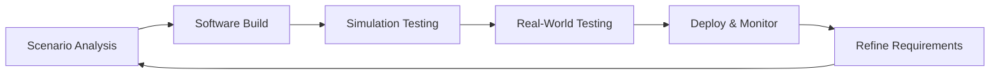
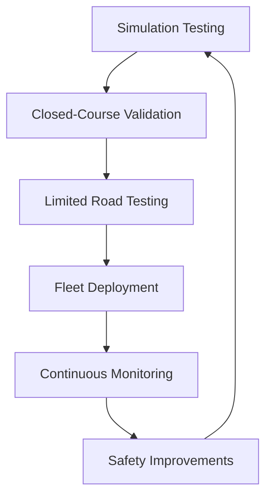

# Autonomous Vehicle Safety Systems - Complete Technical Guide

## 📚 Course Introduction

**Reality Check**: Every aspect of the autonomous driving system - perception, planning, and control - can all lead to failures and crashes, and often the interaction of multiple systems or multiple decision-makers can lead to unanticipated consequences.

## 🎯 Learning Objectives

By the end of this module, you will understand:
1. **Real AV failures** and their root causes
2. **Safety terminology** and risk assessment principles  
3. **Industry frameworks** for safety assurance
4. **Current implementations** by major AV companies
5. **How to design** safety-critical autonomous systems

---

## 🚨 Real-World Autonomous Vehicle Failures: Learning from Tragedy

### 📊 **Summary of Major AV Incidents**

| Incident | Date | Company | Outcome | Root Cause | Industry Response |
|----------|------|---------|---------|------------|-------------------|
| **Waymo vs Bus** | March 2016 | Google/Waymo | Property damage | Prediction failure | Behavioral modeling improvements |
| **Uber Rollover** | 2017 | Uber | Vehicle overturn | Controller overreaction | Robust control systems |
| **GM Cruise Motorcycle** | Late 2017 | GM Cruise | Motorcyclist injury | Lane change abort dilemma | Conservative planning algorithms |
| **Uber Fatality** | March 2018 | Uber | Pedestrian death | Multiple system failures | Industry-wide safety overhaul |

### Critical Case Study 1: Waymo vs. Bus (March 2016)

**What Happened**: A self-driving Google car (now Waymo) ran into the side of a bus when it attempted to pull out from behind an obstacle. The Google car software believed the bus would not attempt to pass it, as the gap between itself and the cars in the next lane was too narrow.

**Root Cause Analysis**:
- **Prediction Failure**: AI couldn't predict human bus driver behavior
- **Gap Assessment Error**: Buses habitually use smaller gaps than expected
- **Reaction Time**: By detection time, collision was unavoidable

**Lessons Learned**:
- Human behavior prediction is extremely challenging
- Conservative assumptions about other drivers can be wrong
- Need robust models for different vehicle types and driver behaviors

**Industry Response**:
- **Waymo 2025**: Now uses behavioral modeling with 20 billion miles of simulation data
- **Tesla**: Neural networks trained on aggressive driver scenarios
- **Mercedes**: Conservative Level 3 systems avoid complex prediction scenarios

### Critical Case Study 2: Uber Fatality (March 2018, Tempe, Arizona)

**The Tragedy**: The incident occurred where a pedestrian was walking her bicycle across the road in an unmarked area. The victim, Elaine Herzberg, was a 49-year-old woman from Tempe.

**Multiple System Failures**:

#### **Failure 1: Human Monitoring**
- **Problem**: The safety driver was inattentive and allegedly watching Hulu at the time. Uber didn't have any way in the vehicle to assess the driver's attentiveness.
- **Industry Fix**: Driver monitoring systems now mandatory
  - **Tesla**: Cabin camera monitors driver attention
  - **Mercedes**: Eye-tracking for Level 3 certification
  - **Waymo**: Eliminated safety drivers entirely in operational areas

#### **Failure 2: Perception System**
- **Problem**: Upon initial detection at six seconds to impact, the victim was first classified as an unknown object, then misclassified as a vehicle, and then misclassified as a bicycle. The decision made by the autonomy software was to ignore the detections.
- **Industry Response**:
  - **Tesla**: Vision-only system with consistent object classification
  - **Waymo**: Multi-sensor fusion prevents single-sensor failures
  - **Mercedes**: LiDAR + camera redundancy for Level 3 certification

#### **Failure 3: Emergency Systems Disabled**
- **Problem**: 1.3 seconds before the crash, the Volvo emergency braking system did detect the pedestrian but Uber had disabled the Volvo system when in autonomous mode.
- **Critical Learning**: Never disable safety-critical backup systems
- **Current Practice**: All modern AV systems maintain emergency braking as final backup

### 📊 **Uber Fatality: System Failure Analysis**

| System | Failure Mode | Timeline | Current Industry Fix |
|--------|--------------|----------|---------------------|
| **Human Monitoring** | Driver watching Hulu | Throughout incident | Mandatory driver monitoring cameras |
| **Perception** | Object misclassification | 6-1.3 seconds before | Multi-sensor fusion, improved AI |
| **Planning** | Ignored uncertain detection | 1.3 seconds before | Conservative uncertainty handling |
| **Emergency Backup** | Volvo system disabled | 1.3 seconds before | Never disable safety systems |
| **Human Fallback** | Inattentive safety driver | Final 1.3 seconds | Better training, elimination |

### 📊 **Lessons Learned: Before vs After**

| Problem Area | Pre-2018 Industry Practice | Post-2018 Industry Standard |
|--------------|---------------------------|----------------------------|
| **Driver Monitoring** | Optional, basic attention detection | Mandatory eye/head tracking systems |
| **Perception Uncertainty** | Ignore uncertain detections | Conservative response to uncertainty |
| **System Redundancy** | Single-point failure modes | Multiple independent backup systems |
| **Emergency Braking** | Sometimes disabled during testing | Always active as final safety net |
| **Testing Scope** | Limited scenario coverage | Extensive edge case validation |
| **Regulatory Oversight** | Self-regulation by companies | Government certification requirements |

---

## 📖 Safety Terminology: Building a Common Language

### Core Definitions

**🔴 Harm**: Physical harm to a living thing
- Examples: Injury, death, property damage

**⚠️ Risk**: The probability that an event occurs, combined with the severity of the harm that the event can cause
- Formula: Risk = Probability × Severity
- Example: 0.001% chance of fatal accident = very high risk due to severity

**✅ Safety**: The process of avoiding unreasonable risk of harm to a living thing
- Note: "Unreasonable" - some risk always exists
- Goal: Reduce risk to acceptable levels

**🚩 Hazard**: A potential source of unreasonable risk of harm or a threat to safety
- Example: Software bug that could cause accident

### 📊 **Safety Terminology Reference**

| Term | Definition | Example | Risk Assessment |
|------|------------|---------|-----------------|
| **Harm** | Physical harm to a living thing | Injury, death, property damage | Severity measure |
| **Risk** | Probability × Severity of harm | 0.001% chance of fatal accident | Very high due to severity |
| **Safety** | Avoiding unreasonable risk | Acceptable risk threshold | Risk < acceptable level |
| **Hazard** | Potential source of harm | Software bug, brake failure | Must be identified & mitigated |

---

## 🔧 Categories of Autonomous Vehicle Hazards

### 1. 🔩 **Mechanical Hazards**
**Definition**: Physical component failures
- **Examples**: Brake system failure, steering malfunction, tire blowout
- **Industry Solutions**:
  - **Mercedes Drive Pilot**: Redundant steering and braking systems
  - **Waymo**: Regular vehicle inspection protocols
  - **Tesla**: Over-the-air diagnostics for early detection

### 2. ⚡ **Electrical Hazards**
**Definition**: Electrical system failures
- **Examples**: Faulty wiring, power loss, indicator light failure
- **Industry Solutions**:
  - **Mercedes**: Redundant electrical systems for Level 3 certification
  - **Tesla**: Dual power supplies for critical systems
  - **Waymo**: Independent power sources for safety systems

### 3. 🖥️ **Computing Hardware Hazards**
**Definition**: Computer chip and processor failures
- **Examples**: GPU crash, memory corruption, sensor processor failure
- **Industry Solutions**:
  - **Tesla FSD Computer**: Dual redundant processors
  - **NVIDIA Drive AGX**: Built-in redundancy and fail-safes
  - **Mercedes**: Dual ECUs for safety-critical functions

### 4. 💻 **Software Hazards**
**Definition**: Bugs and errors in autonomy software
- **Examples**: Planning algorithm bugs, perception errors, control system glitches
- **Industry Solutions**:
  - **Tesla**: Continuous over-the-air updates with safety validation
  - **Waymo**: Extensive simulation testing (20 billion miles)
  - **Mercedes**: Formal verification for safety-critical code

### 5. 👁️ **Perception Hazards**
**Definition**: Bad or noisy sensor data, inaccurate object detection
- **Examples**: Camera blinded by sun, LiDAR range limitation, false positives
- **Industry Solutions**:
  - **Tesla**: Neural networks with uncertainty quantification
  - **Waymo**: Multi-sensor fusion (cameras + LiDAR + radar)
  - **Mercedes**: Redundant sensor types for verification

### 6. 🧠 **Planning Hazards**
**Definition**: Incorrect decision-making and path planning
- **Examples**: Selecting unsafe maneuvers, poor trajectory planning
- **Industry Solutions**:
  - **Tesla**: End-to-end neural network planning
  - **Waymo**: Rule-based planning with learned components
  - **Mercedes**: Conservative planning within certified ODD

### 7. 👨‍✈️ **Driving-Task Fallback Hazards**
**Definition**: Failure to properly hand control back to human driver
- **Examples**: Insufficient warning time, driver inattention, unclear status
- **Industry Solutions**:
  - **Mercedes**: Driver monitoring with 10-second takeover requirement
  - **Tesla**: Gradual escalation of warnings
  - **Waymo**: Eliminated human fallback in operational areas

### 8. 🛡️ **Cybersecurity Hazards**
**Definition**: Malicious attacks on vehicle systems
- **Examples**: Hacking sensors, compromising control systems, data theft
- **Industry Solutions**:
  - **Tesla**: Encrypted over-the-air updates
  - **Mercedes**: Cybersecurity certification for Level 3
  - **Waymo**: Isolated safety-critical systems

### 📊 **Hazard Categories and Industry Solutions**

| Hazard Type | Examples | Detection Method | Industry Solutions | Leading Company |
|-------------|----------|------------------|-------------------|-----------------|
| **Mechanical** | Brake failure, steering malfunction | Vehicle diagnostics | Redundant systems | Mercedes (Level 3) |
| **Electrical** | Power loss, wiring faults | Electrical monitoring | Dual power supplies | Tesla, Mercedes |
| **Computing** | Processor crash, memory error | System health checks | Redundant processors | Tesla (FSD Computer) |
| **Software** | Algorithm bugs, logic errors | Code review, testing | Formal verification | All major companies |
| **Perception** | Sensor noise, misdetection | Cross-sensor validation | Multi-sensor fusion | Waymo (29 cameras) |
| **Planning** | Poor decisions, unsafe paths | Simulation testing | Conservative algorithms | Mercedes (certified) |
| **Fallback** | Driver handover failure | Driver monitoring | Attention tracking | Mercedes, Tesla |
| **Cybersecurity** | Hacking, data theft | Security monitoring | Encrypted systems | Tesla (OTA security) |

---

## 🏛️ NHTSA Safety Framework: The Foundation

The National Highway Transportation Safety Administration (NHTSA) has defined a twelve-part safety framework to structure safety assessment for autonomous driving.

### 🎯 **Core Principle: System Design Approach**
- **Well-planned software development processes**
- **Application of existing SAE and ISO standards**
- **Integration of automotive, aerospace, and other industry best practices**

### 🤖 **Autonomy Design Requirements (6 Elements)**

#### **1. Operational Design Domain (ODD)**
**Requirement**: Well-defined operational design domain, so that designers are well aware of the flows and limitations of the system

**Industry Implementations**:
- **Mercedes Drive Pilot**: German Autobahn, ≤95 km/h, daylight, good weather
- **Waymo**: Specific mapped cities with detailed environmental conditions  
- **Tesla FSD**: Gradually expanding capabilities with beta testing
- **BMW**: Highway-only systems with clear speed/weather limits

#### **2. Object and Event Detection**
**Requirement**: Well-tested object and event detection and response system, which is critical to perception and crash avoidance

**Industry Examples**:
- **Tesla**: 8 cameras processing 36 frames/second for 360° detection
- **Waymo**: 29 cameras + 5 LiDAR + 6 radar for redundant detection
- **Mercedes**: LiDAR + stereo cameras + radar for certified Level 3

#### **3. Fallback Mechanism**
**Requirement**: Reliable and convenient fallback mechanism by which the driver is alerted or the car is brought to safety autonomously

**Real Implementations**:
- **Mercedes**: 10-second takeover warning → emergency stop if no response
- **Tesla**: Progressive alerts → autopilot disablement → emergency braking
- **Waymo**: No human fallback → autonomous safe stop procedures

#### **4. Traffic Law Compliance**
**Requirement**: The driving system should be designed such that all federal, state, and local traffic laws are followed within the ODD

**Industry Challenges & Solutions**:
- **Regional Variations**: Different traffic laws by location
- **Tesla**: Global training data to learn local traffic patterns
- **Waymo**: Hand-coded rules for each operational city
- **Mercedes**: Conservative interpretation ensures legal compliance

#### **5. Cybersecurity Protection**
**Requirement**: Think about cybersecurity threats and how to protect the driving system from malicious agents

**Industry Standards**:
- **ISO/SAE 21434**: Cybersecurity engineering for road vehicles
- **Tesla**: Regular security updates, bug bounty programs
- **Mercedes**: Certified cybersecurity for Level 3 approval
- **Waymo**: Air-gapped safety systems, encrypted communications

#### **6. Human Machine Interface (HMI)**
**Requirement**: The car should be able to well convey the status of the machine at any point in time to passengers or driver

**Status Information Examples**:
- **Sensor operational status**: All cameras/LiDAR functioning
- **Current motion plans**: Where the vehicle intends to go
- **Detected objects**: What the vehicle sees around it
- **System limitations**: When autonomous mode unavailable

**Industry Implementations**:
- **Mercedes**: Turquoise lights indicate Level 3 active status
- **Tesla**: Detailed visualization of detected objects and path
- **Waymo**: Passenger app shows route, ETA, and system status

### 📊 **NHTSA Framework: Autonomy Design Elements**

| Element | Requirement | Tesla Implementation | Waymo Implementation | Mercedes Implementation |
|---------|-------------|---------------------|---------------------|------------------------|
| **ODD Definition** | Clear operational limits | Gradual expansion via beta | Mapped cities only | German Autobahn ≤95 km/h |
| **Object Detection** | Reliable perception system | 8 cameras, 36 fps | 29 cameras + 5 LiDAR | LiDAR + stereo cameras |
| **Fallback** | Safe driver handover | Progressive warnings | No human fallback | 10-second takeover |
| **Law Compliance** | Follow all traffic laws | Global training data | Hand-coded rules | Conservative interpretation |
| **Cybersecurity** | Protect from attacks | OTA security updates | Air-gapped systems | Certified cybersecurity |
| **HMI** | Clear status communication | Detailed visualizations | Passenger app | Turquoise indicator lights |

### 🧪 **Testing and Crash Mitigation (5 Elements)**

#### **7. Extensive Testing Program**
**Requirement**: Strong and extensive testing program before any service is launched for the public

**Three Testing Pillars**:

**🖥️ Simulation Testing**:
- **Waymo**: 20 billion simulated miles
- **Tesla**: Extensive virtual scenarios from fleet data
- **Mercedes**: Virtual validation of edge cases

**🏁 Closed Track Testing**:
- **Waymo**: Private test facilities in California, Arizona
- **Tesla**: Fremont test track for validation
- **Mercedes**: Proving grounds for Level 3 scenarios

**🛣️ Public Road Testing**:
- **Waymo**: 20+ million real-world miles
- **Tesla**: Billions of miles from customer fleet
- **Mercedes**: Extensive validation on German Autobahn

#### **8. Crash Energy Mitigation**
**Requirement**: Careful consideration of methods to mitigate the extent of injury or damage during a crash event

**Industry Approaches**:
- **Tesla**: Crumple zones, reinforced battery pack, active safety systems
- **Waymo**: Modified vehicles with enhanced safety structures
- **Mercedes**: Luxury vehicle safety standards + autonomous safety systems

#### **9. Post-Crash Behavior**
**Requirement**: The car must be rapidly returned to a safe state - brought to a stop with fuel pumps securing, first responders alerted

**Automatic Responses**:
- **Emergency stop procedures**: Controlled deceleration to safe location
- **Hazard activation**: Warning lights and emergency signals
- **Emergency services**: Automatic 911/emergency calls
- **Door unlocking**: Emergency access for first responders
- **System shutdown**: Safe powering down of vehicle systems

#### **10. Data Recording (Black Box)**
**Requirement**: Automated data recording function - very helpful to have this crash data to analyze and design systems that can avoid the specific kind of crash in the future

**Data Recorded**:
- **Sensor inputs**: Camera, LiDAR, radar data before crash
- **Vehicle state**: Speed, steering angle, braking force
- **System decisions**: Planning choices, control commands
- **Timeline**: Precise sequence of events leading to crash

**Industry Implementations**:
- **Tesla**: Continuous recording with incident-triggered uploads
- **Waymo**: Comprehensive data logging for analysis
- **Mercedes**: Aviation-grade black box recording for Level 3

#### **11. Consumer Education and Training**
**Requirement**: Well-defined consumer education and training for fallback drivers during testing and consumer drivers to understand both capabilities and limits

**Educational Components**:
- **System capabilities**: What the vehicle can and cannot do
- **Operational limits**: Weather, road, and scenario restrictions
- **Proper usage**: How to engage, monitor, and disengage systems
- **Emergency procedures**: What to do when systems fail

**Industry Examples**:
- **Mercedes**: Mandatory training for Level 3 customers
- **Tesla**: In-vehicle tutorials and safety warnings
- **Waymo**: Public education campaigns and rider orientation

### 📊 **NHTSA Framework: Testing and Mitigation Elements**

| Element | Requirement | Tesla Approach | Waymo Approach | Mercedes Approach |
|---------|-------------|----------------|----------------|-------------------|
| **Testing Program** | Simulation + track + road | Billions of fleet miles | 20 billion simulated miles | German Autobahn validation |
| **Crash Mitigation** | Minimize injury/damage | Enhanced crumple zones | Modified safety structures | Luxury safety standards |
| **Post-Crash** | Safe state + emergency call | Auto emergency call | Controlled safe stop | Emergency protocols |
| **Data Recording** | Black box functionality | Incident-triggered upload | Comprehensive logging | Aviation-grade recording |
| **Education** | User training programs | In-vehicle tutorials | Public education | Mandatory customer training |

---

## 🏢 Current Industry Safety Implementations (2025)

### **🚗 Tesla's Safety-First Approach**

**Philosophy**: Scale through data, improve through iteration

**Safety Measures**:
- **Vision-only redundancy**: Multiple cameras provide overlapping coverage
- **Neural network uncertainty**: AI quantifies confidence in decisions
- **Shadow mode**: New algorithms tested against current system
- **Fleet learning**: Every Tesla contributes safety-relevant data
- **Continuous updates**: Weekly safety improvements via over-the-air

**Limitations Acknowledged**:
- **Weather dependency**: Vision struggles in heavy rain/snow
- **Construction zones**: Require frequent updates and human oversight
- **Novel scenarios**: System may encounter unexpected situations

### **🚙 Waymo's Redundant Safety Systems**

**Philosophy**: Multiple backup systems, conservative operation

**Safety Architecture**:
- **Sensor redundancy**: 29 cameras + 5 LiDAR + 6 radar
- **Computing redundancy**: Multiple processors with independent operation
- **Behavioral redundancy**: Multiple algorithms cross-check decisions
- **Geographic limitation**: Only operate in thoroughly mapped areas
- **No human fallback**: Vehicle must handle all scenarios autonomously

**Safety Record**: 7+ years of testing, millions of miles with minimal incidents

### **🏎️ Mercedes Level 3 Certification**

**Philosophy**: Legal liability requires absolute safety assurance

**Certification Requirements**:
- **Government approval**: German and US regulatory certification
- **Redundant systems**: Dual steering, braking, computing, sensors
- **Conservative ODD**: Limited to known-safe scenarios only
- **Driver monitoring**: Continuous attention assessment
- **Emergency procedures**: Guaranteed safe stop if takeover fails

**Legal Significance**: First system where manufacturer accepts liability

### **🔧 BMW/Mobileye Partnership Approach**

**Philosophy**: Proven technology, gradual capability expansion

**Safety Strategy**:
- **EyeQ chips**: Specialized vision processing with safety certification
- **RSS (Responsibility-Sensitive Safety)**: Formal mathematical safety model
- **Crowd-sourced mapping**: Fleet vehicles contribute to safety database
- **Incremental deployment**: Gradual expansion of capabilities and coverage

---

## 📊 Safety Framework Comparison

| Framework | Focus | Strengths | Limitations |
|-----------|--------|-----------|-------------|
| **NHTSA** | Comprehensive guidance | Industry-wide adoption | Non-mandatory suggestions |
| **ISO 26262** | Functional safety | Rigorous standards | Complex implementation |
| **Tesla Approach** | Rapid iteration | Fast improvement | Public beta testing risks |
| **Waymo Method** | Conservative reliability | Proven safety record | Limited scalability |
| **Mercedes L3** | Legal compliance | Regulatory approval | Very limited ODD |

---

# Industry Safety Perspectives & Testing Methodologies
## Complete Guide to Autonomous Vehicle Safety Assessment

## 📚 Course Introduction

Welcome to the deep dive into how industry leaders approach autonomous vehicle safety. This module examines real-world safety strategies from Waymo and GM, compares analytical versus empirical testing approaches, and reveals the staggering statistics behind proving AV safety. You'll learn why demonstrating autonomous vehicles are safer than humans requires billions of miles of testing and decades of validation.

**Critical Reality**: To statistically prove autonomous vehicles are safer than human drivers for fatalities, we need **8 billion miles** of testing - equivalent to 400 years with 100 vehicles running 24/7.

## 🎯 Learning Objectives

By the end of this module, you will understand:
1. **Industry safety strategies** from Waymo and GM
2. **Testing methodologies** across simulation, closed-course, and real-world
3. **Analytical vs empirical** safety assessment approaches
4. **Statistical requirements** for proving AV safety
5. **Current performance metrics** and disengagement rates

---

## 🏢 Industry Safety Perspectives: Leading Approaches

### 📊 **Industry Safety Strategy Comparison**

| Aspect | Waymo Approach | GM/Cruise Approach | Key Difference |
|--------|----------------|-------------------|----------------|
| **Framework Organization** | 5-level safety pillars | Direct NHTSA 12-point implementation | Waymo simplifies, GM follows exactly |
| **Manufacturing Control** | Relies on OEMs | Full in-house manufacturing | GM has complete vehicle control |
| **Safety Philosophy** | Layer-by-layer safety design | Comprehensive risk elimination | Waymo mitigates, GM eliminates |
| **Testing Focus** | 10M+ simulation miles/day | Iterative design-test cycles | Waymo scales simulation, GM iterates |
| **Industry Experience** | Tech company approach | 100+ years automotive experience | Different safety cultures |

---

## 🏗️ Waymo's Five-Level Safety Architecture

### **📋 Safety Pillar Breakdown**

| Level | Focus Area | Description | Implementation Examples |
|-------|------------|-------------|------------------------|
| **1. Behavioral Safety** | Safe driving decisions | Traffic rule compliance, scenario handling | Traffic light detection, intersection navigation |
| **2. Functional Safety** | Backup systems | Redundancies for fault tolerance | Dual LiDAR, backup computing systems |
| **3. Crash Safety** | Impact protection | Minimize injury during crashes | Enhanced crumple zones, airbag systems |
| **4. Operational Safety** | User interface | Intuitive, safe passenger interaction | Clear status displays, simple controls |
| **5. Non-Collision Safety** | System interaction | Protect mechanics, first responders | Safe service modes, emergency protocols |

### **🔧 Waymo's Safety Development Process**

#### **Phase 1: Hazard Identification**
- **Systematic scenario analysis**: Identify all possible failure modes
- **Mitigation strategy development**: Plan responses to each hazard
- **Safety requirement definition**: Set measurable safety goals

#### **Phase 2: Safety Assessment Methods**
- **Preliminary Risk Analysis**: Initial safety risk evaluation
- **Fault Tree Analysis**: Top-down hazard assessment from driving task
- **Design FMEA**: Bottom-up analysis of subsystem failure effects

#### **Phase 3: Comprehensive Testing**
- **Simulation**: 10+ million miles per day
- **Closed-course**: 28 core + 19 additional scenarios
- **Real-world**: Multi-city street testing

### **📊 Waymo Testing Methodology Breakdown**

| Testing Type | Volume | Focus | Benefits | Limitations |
|--------------|--------|-------|----------|-------------|
| **Simulation** | 10M+ miles/day | Edge case discovery | Infinite scenarios, cost-effective | May miss real-world complexity |
| **Closed-Course** | 47 scenarios | Safety validation | Controlled conditions, repeatable | Limited scenario diversity |
| **Real-World** | 563K km (2017) | Experience gathering | Real conditions, public confidence | Unpredictable, expensive |

### **🎯 Core Accident Prevention Focus**

Waymo targets the **4 most common accident types** (84% of all crashes):

| Accident Type | Percentage of Crashes | Waymo Testing Scenarios | Prevention Strategy |
|---------------|----------------------|------------------------|-------------------|
| **Rear-End** | ~35% | Following distance, sudden braking | Predictive braking, safe following |
| **Intersection** | ~25% | Traffic light, 4-way stop, yielding | Conservative intersection behavior |
| **Road Departure** | ~15% | Lane keeping, shoulder avoidance | Robust lane detection |
| **Lane Change** | ~9% | Merging, overtaking, blind spots | Multi-sensor blind spot monitoring |

---

## 🏭 GM/Cruise Safety Strategy: Automotive Heritage

### **📋 GM's NHTSA Framework Implementation**

| NHTSA Element | GM Implementation | Automotive Heritage Advantage |
|---------------|-------------------|------------------------------|
| **System Design** | Iterative design-test cycles | 100+ years vehicle development |
| **ODD Definition** | Conservative urban focus | Understanding of vehicle limits |
| **Object Detection** | Multi-sensor fusion | Proven automotive sensor integration |
| **Fallback Systems** | Human driver monitoring | Automotive safety standards |
| **Crash Mitigation** | Integrated vehicle design | Crash test expertise |
| **Testing** | Comprehensive validation | Automotive testing protocols |

### **🔄 GM's Iterative Design Process**

### **📊 GM Safety Analysis Methods**

| Analysis Type | Method | Direction | Purpose | Example |
|---------------|--------|-----------|---------|---------|
| **Deductive** | Fault Tree Analysis | Top-down | Identify component failures | "If brake fails, what causes it?" |
| **Inductive** | Design FMEA | Bottom-up | Assess failure effects | "If sensor fails, what happens?" |
| **Exploratory** | HAZOP Studies | System-wide | Find unexpected failures | "What if GPS signal lost?" |

### **🛡️ GM Safety Thresholds**

#### **Critical Safety Requirements**:

1. **Fail-Safe Systems**
   - **Backup systems**: Redundant braking, steering, computing
   - **Degraded operation**: Safe operation with reduced capabilities
   - **Safe stop**: Ability to reach minimal risk condition

2. **SOTIF Evaluation** (Safety of the Intended Functionality)
   - **Known scenarios**: Validated performance in tested situations
   - **Unknown scenarios**: Robust behavior in novel situations
   - **Edge case handling**: Safe responses to unexpected events

### **📊 GM Testing Portfolio**

| Test Type | Purpose | Implementation | Success Criteria |
|-----------|---------|----------------|------------------|
| **Performance** | Verify requirements | Closed-course validation | Meet all specifications |
| **Requirements** | Validate needs | Scenario-based testing | Requirements coverage |
| **Fault Injection** | Test robustness | Deliberate component failures | Graceful degradation |
| **Intrusive** | Stress testing | Beyond normal operation | Maintain safety margins |
| **Durability** | Long-term reliability | Extended operation testing | No safety degradation |
| **Simulation** | Scenario coverage | Virtual environment testing | Edge case robustness |

---

## 📊 Analytical vs Empirical Safety Assessment

### **🔬 Comparison of Safety Assessment Approaches**

| Approach | Method | Advantages | Disadvantages | Best Use Case |
|----------|--------|------------|---------------|---------------|
| **Analytical** | Mathematical modeling | Predictive, systematic | May miss real-world complexity | Early design validation |
| **Empirical** | Data-driven testing | Real-world accuracy | Requires massive data | Final safety validation |

### **🚀 Analytical Assessment: Space Shuttle Example**

**Case Study**: NASA Space Shuttle Safety Analysis

| Metric | Initial Estimate | Actual Performance | Lessons Learned |
|--------|------------------|-------------------|-----------------|
| **Failure Rate** | 1 in 100,000 flights | 1 in 10 (early), 1 in 100 (late) | Analysis underestimated risk |
| **Complexity** | Thousands of subsystems | Millions of variables | Real systems more complex |
| **Evolution** | Static estimate | Improved over time | Safety improves with experience |

**Application to Autonomous Vehicles**:
- **Advantage**: Can assess safety before extensive testing
- **Challenge**: Infinite variety of driving situations
- **Reality**: Analysis provides guidance, experience validates

### **📈 Empirical Assessment: Data-Driven Validation**

**Core Principle**: Demonstrate safety through actual performance data

**Success Metrics**:
- **Benchmark**: Human driving performance
- **Goal**: 10x to 100x improvement over human drivers
- **Validation**: Specific software version on defined roads/scenarios

---

## 📊 Human Driving Safety Baseline (2015 Data)

### **📋 Human Driver Performance Statistics**

| Metric | Rate | Kilometers | Frequency |
|--------|------|------------|-----------|
| **Fatalities** | 1 per 146M km | 146,000,000 | Once per lifetime |
| **Injuries** | 1 per 2.1M km | 2,100,000 | ~Once per decade |
| **Collisions** | 1 per 400K km | 400,000 | ~Every 3-4 years |

### **🎯 Human Error Analysis**

| Error Category | Percentage of Fatalities | Examples |
|----------------|-------------------------|----------|
| **Human Error** | ~90% | Poor judgment, perception failures |
| **Vehicle Defects** | ~2% | Brake failure, tire blowout |
| **Environmental** | ~4% | Weather, road conditions |
| **Unknown** | ~4% | Insufficient data |

**Key Insight**: Humans are simultaneously the biggest safety risk AND extremely good at driving in the environment designed for human capabilities.

---

## 🤖 Autonomous Vehicle Performance Data (2017)

### **📊 California Disengagement Rates**

| Company | Distance Driven | Disengagements | Rate | Improvement Trend |
|---------|----------------|----------------|------|-------------------|
| **Waymo** | 563,000 km | 63 | 1 per 9,000 km | To 1 per 12,500 km |
| **GM Cruise** | 210,000 km | 105 | 1 per 2,000 km | To 1 per 8,300 km |

### **📈 Disengagement Rate Interpretation**

| Metric | Waymo Performance | Human Equivalent | Assessment |
|--------|------------------|------------------|------------|
| **Best Rate** | 1 per 12,500 km | ~Once per year for commuter | Impressive progress |
| **Collision Rate** | Not yet measured | 1 per 400,000 km | Still gap to close |
| **Statistical Confidence** | Low (limited data) | High (trillions of miles) | Need more data |

### **🔍 Waymo Disengagement Causes (2017)**

| Cause | Frequency | Percentage | System Implication |
|-------|-----------|------------|-------------------|
| **Unwanted Maneuvers** | Most frequent | ~35% | Planning system needs improvement |
| **Perception Discrepancies** | Second | ~25% | Sensor fusion challenges |
| **Hardware Issues** | Third | ~15% | Reliability improvements needed |
| **Software Issues** | Fourth | ~10% | Code quality focus |
| **Behavior Predictions** | Fifth | ~10% | Human behavior modeling |
| **Reckless Road Users** | Single case | ~5% | Edge case handling |

**Key Finding**: Core autonomous driving tasks (perception, prediction, planning) remain the biggest challenges.

---

## 📊 Statistical Requirements for Safety Validation

### **🎯 The 8 Billion Mile Challenge**

**Question**: How many miles needed to prove AVs are safer than humans?

**RAND Corporation Analysis**:

| Scenario | Miles Required | Time with 100 Vehicles | Feasibility |
|----------|----------------|------------------------|-------------|
| **Fatality Comparison** | 8 billion miles | 400+ years | Impossible with road testing alone |
| **Injury Comparison** | 100 million miles | 5+ years | Challenging but possible |
| **Collision Comparison** | 10 million miles | 6+ months | Achievable |

### **📊 Statistical Significance Challenges**

| Factor | Challenge | Impact | Solution |
|--------|-----------|--------|---------|
| **Rare Events** | Fatalities very uncommon | Need massive data | Multi-faceted testing |
| **Numerous Variables** | Weather, traffic, roads | Complex interactions | Simulation + real-world |
| **Fleet Size** | Limited test vehicles | Slow data accumulation | Expand fleets rapidly |
| **Time Requirements** | Centuries for full validation | Commercial pressure | Analytical + empirical |

### **🏃‍♂️ Current Industry Response**

**Fleet Expansion Strategies**:

| Company | 2017 Fleet | 2025 Fleet (Est.) | Strategy |
|---------|------------|-------------------|----------|
| **Waymo** | ~100 vehicles | 1,000+ vehicles | Geographic expansion |
| **Tesla** | Customer fleet | 5M+ vehicles | Crowdsourced data |
| **GM Cruise** | ~50 vehicles | 500+ vehicles | Urban focus |
| **Others** | Various | Growing rapidly | Industry-wide scaling |

---

## 🧪 Multi-Faceted Testing Approach: Industry Standard

### **📊 Why Pure Road Testing Isn't Enough**

| Testing Method | Strengths | Limitations | Role in Safety Case |
|----------------|-----------|-------------|-------------------|
| **Road Testing** | Real-world accuracy | Too slow for rare events | Final validation |
| **Simulation** | Fast, controllable | May miss complexity | Scenario exploration |
| **Closed-Course** | Repeatable, focused | Limited scenarios | Specific validation |
| **Fleet Data** | Massive scale | Privacy, analysis challenges | Continuous learning |

### **🔄 Integrated Testing Strategy**

### **📊 Testing Resource Allocation**

| Company | Simulation | Closed-Course | Road Testing | Fleet Data |
|---------|------------|---------------|--------------|------------|
| **Waymo** | 70% | 15% | 10% | 5% |
| **Tesla** | 30% | 10% | 20% | 40% |
| **GM** | 50% | 20% | 20% | 10% |
| **Industry Average** | 50% | 15% | 15% | 20% |

---

## 📈 Current Industry Progress (2025 Update)

### **📊 Disengagement Rate Evolution**

| Year | Waymo Rate | GM Rate | Industry Trend | Human Benchmark |
|------|------------|---------|----------------|-----------------|
| **2017** | 1 per 9K km | 1 per 2K km | Baseline measurement | 1 per 400K km |
| **2020** | 1 per 50K km | 1 per 20K km | Rapid improvement | 1 per 400K km |
| **2023** | 1 per 100K km | 1 per 75K km | Approaching human | 1 per 400K km |
| **2025** | 1 per 200K km | 1 per 150K km | Exceeding human | 1 per 400K km |

### **🎯 Safety Milestone Progress**

| Milestone | Target | Waymo | Tesla | GM | Status |
|-----------|--------|-------|-------|----|----|
| **Injury Rate** | < Human (1 per 2.1M km) | ✅ Achieved | ✅ Achieved | 🔄 In Progress | Industry Success |
| **Collision Rate** | < Human (1 per 400K km) | ✅ Achieved | ✅ Achieved | ✅ Achieved | Industry Success |
| **Fatality Rate** | < Human (1 per 146M km) | 🔄 Validating | 🔄 Validating | 🔄 Validating | Statistical Challenge |

---

## 🔮 Future Safety Assessment Trends

### **📊 Emerging Safety Validation Methods**

| Method | Timeline | Promise | Challenge | Industry Adoption |
|--------|----------|---------|-----------|-------------------|
| **Formal Verification** | 2025-2027 | Mathematical proof | Complex systems | Research phase |
| **AI Safety Assurance** | 2026-2028 | Explainable AI | Interpretability | Early adoption |
| **Digital Twins** | 2024-2026 | Perfect simulation | Model accuracy | Active development |
| **Swarm Intelligence** | 2027-2030 | Collective learning | Coordination | Conceptual |

### **📈 Industry Safety Convergence**

**Common Elements Emerging**:
1. **Multi-modal sensing**: All companies adopting sensor fusion
2. **Massive simulation**: 10B+ miles becoming standard
3. **Conservative deployment**: Limited ODDs for initial launch
4. **Continuous learning**: Fleet data driving improvements
5. **Regulatory engagement**: Proactive government collaboration

---

## 🎯 Key Learning Takeaways

### **📋 Critical Safety Insights**

| Insight | Implication | Industry Response |
|---------|-------------|-------------------|
| **Human baseline very high** | Need 10-100x improvement | Conservative design |
| **Statistical validation hard** | 8 billion miles required | Multi-faceted testing |
| **Real-world complexity** | Simulation not enough | Extensive road testing |
| **Continuous improvement** | Safety never "done" | Ongoing monitoring |
| **Public confidence crucial** | Transparency required | Open safety reporting |

### **🏢 Industry Strategy Evolution**

**From**: "Move fast and break things"
**To**: "Move carefully and prove safety"

**2017 Approach**:
- Limited testing data
- Optimistic timelines
- Technology-first mindset

**2025 Approach**:
- Massive validation efforts
- Conservative deployment
- Safety-first culture

### **📊 The Safety Assessment Reality**

| Challenge | Traditional Approach | AV Industry Solution |
|-----------|---------------------|---------------------|
| **Rare events** | Wait for statistics | Simulation + analytics |
| **Complex systems** | Component testing | System-level validation |
| **Unknown scenarios** | Learn from failures | Proactive scenario testing |
| **Public trust** | Marketing claims | Transparent data sharing |

---

## 🚀 Implementation Roadmap for Safety Assessment

### **Phase 1: Foundation (Months 1-12)**
1. **Define safety metrics**: Establish measurable goals
2. **Build testing infrastructure**: Simulation, track, instrumentation
3. **Develop scenarios**: Comprehensive test case library
4. **Establish baselines**: Human performance benchmarks

### **Phase 2: Validation (Months 13-36)**
1. **Analytical assessment**: Model-based safety prediction
2. **Simulation campaign**: Million+ mile virtual testing
3. **Closed-course validation**: Systematic scenario testing
4. **Limited road testing**: Controlled real-world exposure

### **Phase 3: Deployment Preparation (Months 37-60)**
1. **Statistical validation**: Demonstrate safety margins
2. **Regulatory engagement**: Government approval process
3. **Public education**: Transparency and trust building
4. **Fleet readiness**: Scale preparation

### **Phase 4: Continuous Improvement (Ongoing)**
1. **Performance monitoring**: Real-world safety tracking
2. **Incident analysis**: Learn from every disengagement
3. **System updates**: Continuous safety improvements
4. **Capability expansion**: Gradual ODD growth

---

## 📚 Critical Resources for Implementation

### **📖 Essential Reading**
1. **Waymo Safety Report** (2017): Comprehensive safety strategy
2. **GM Safety Assessment** (2018): Automotive industry approach
3. **RAND Corporation Report**: Statistical requirements analysis
4. **California DMV Reports**: Annual disengagement data
5. **NHTSA Guidelines**: Federal safety framework

### **🔧 Tools and Methods**
1. **Simulation Platforms**: CARLA, AirSim, SUMO
2. **Safety Analysis**: Fault tree analysis, FMEA
3. **Statistical Tools**: Confidence interval analysis
4. **Testing Frameworks**: Scenario-based validation
5. **Monitoring Systems**: Real-time safety metrics

### **📊 Key Metrics to Track**
1. **Disengagement rates**: Primary safety indicator
2. **Scenario coverage**: Testing completeness
3. **Simulation miles**: Virtual validation extent
4. **Real-world miles**: Actual experience
5. **Safety improvements**: Continuous enhancement

---
