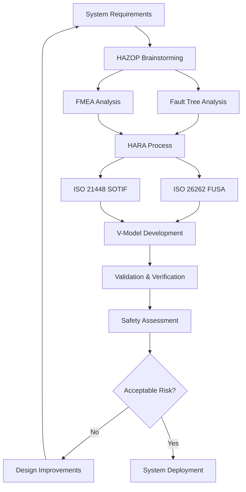

# Autonomous Vehicle Safety Systems - Complete Guide

## 🎯 Overview

This guide covers real-world AV failures, safety frameworks, industry implementations, and testing methodologies. Learn how companies approach autonomous vehicle safety and the massive statistical challenges involved.

**Critical Reality**: Proving AVs are safer than humans for fatalities requires **8 billion miles** of testing - equivalent to 400 years with 100 vehicles running 24/7.

---

## 🚨 Major AV Incidents & Root Cause Analysis

### Summary of Critical Failures

| Incident | Date | Company | Outcome | Root Cause | Industry Response |
|----------|------|---------|---------|------------|-------------------|
| **Waymo vs Bus** | March 2016 | Google/Waymo | Property damage | Prediction failure | Behavioral modeling improvements |
| **Uber Rollover** | 2017 | Uber | Vehicle overturn | Controller overreaction | Robust control systems |
| **GM Cruise Motorcycle** | Late 2017 | GM Cruise | Motorcyclist injury | Lane change abort dilemma | Conservative planning algorithms |
| **Uber Fatality** | March 2018 | Uber | Pedestrian death | Multiple system failures | Industry-wide safety overhaul |

### Critical Case Study: Uber Fatality (March 2018)

**The Tragedy**: Elaine Herzberg, 49, killed while crossing unmarked area in Tempe, Arizona.

#### Multiple System Failures Analysis

| System | Failure Mode | Timeline | Current Industry Fix |
|--------|--------------|----------|---------------------|
| **Human Monitoring** | Driver watching Hulu | Throughout incident | Mandatory driver monitoring cameras |
| **Perception** | Object misclassified 3 times (unknown→vehicle→bicycle) | 6-1.3 seconds before | Multi-sensor fusion, improved AI |
| **Planning** | Ignored uncertain detections | 1.3 seconds before | Conservative uncertainty handling |
| **Emergency Backup** | Volvo system disabled | 1.3 seconds before | Never disable safety systems |
| **Human Fallback** | Inattentive safety driver | Final 1.3 seconds | Better training, elimination |

#### Before vs After Industry Standards

| Problem Area | Pre-2018 Practice | Post-2018 Standard |
|--------------|-------------------|-------------------|
| **Driver Monitoring** | Optional attention detection | Mandatory eye/head tracking |
| **Perception Uncertainty** | Ignore uncertain detections | Conservative response to uncertainty |
| **System Redundancy** | Single-point failure modes | Multiple independent backup systems |
| **Emergency Braking** | Sometimes disabled during testing | Always active as final safety net |
| **Testing Scope** | Limited scenario coverage | Extensive edge case validation |
| **Regulatory Oversight** | Self-regulation | Government certification requirements |

---

## 📖 Safety Terminology & Risk Assessment

### Core Definitions

| Term | Definition | Example | Risk Assessment |
|------|------------|---------|-----------------|
| **Harm** | Physical harm to living beings | Injury, death, property damage | Severity measure |
| **Risk** | Probability × Severity of harm | 0.001% chance of fatal accident | Very high due to severity |
| **Safety** | Avoiding unreasonable risk | Acceptable risk threshold | Risk < acceptable level |
| **Hazard** | Potential source of harm | Software bug, brake failure | Must be identified & mitigated |

### Categories of AV Hazards

| Hazard Type | Examples | Detection Method | Industry Solutions | Leading Company |
|-------------|----------|------------------|-------------------|-----------------|
| **Mechanical** | Brake failure, steering malfunction | Vehicle diagnostics | Redundant systems | Mercedes (Level 3) |
| **Electrical** | Power loss, wiring faults | Electrical monitoring | Dual power supplies | Tesla, Mercedes |
| **Computing** | Processor crash, memory error | System health checks | Redundant processors | Tesla (FSD Computer) |
| **Software** | Algorithm bugs, logic errors | Code review, testing | Formal verification | All major companies |
| **Perception** | Sensor noise, misdetection | Cross-sensor validation | Multi-sensor fusion | Waymo (29 cameras) |
| **Planning** | Poor decisions, unsafe paths | Simulation testing | Conservative algorithms | Mercedes (certified) |
| **Fallback** | Driver handover failure | Driver monitoring | Attention tracking | Mercedes, Tesla |
| **Cybersecurity** | Hacking, data theft | Security monitoring | Encrypted systems | Tesla (OTA security) |

---

## 🏛️ NHTSA 12-Point Safety Framework

### Core Principle: System Design Approach
- Well-planned software development processes
- Application of existing SAE and ISO standards  
- Integration of automotive, aerospace, and other industry best practices

### Autonomy Design Requirements (6 Elements)

| Element | Requirement | Tesla Implementation | Waymo Implementation | Mercedes Implementation |
|---------|-------------|---------------------|---------------------|------------------------|
| **ODD Definition** | Clear operational limits | Gradual expansion via beta | Mapped cities only | German Autobahn ≤95 km/h |
| **Object Detection** | Reliable perception system | 8 cameras, 36 fps | 29 cameras + 5 LiDAR | LiDAR + stereo cameras |
| **Fallback** | Safe driver handover | Progressive warnings | No human fallback | 10-second takeover |
| **Law Compliance** | Follow all traffic laws | Global training data | Hand-coded rules | Conservative interpretation |
| **Cybersecurity** | Protect from attacks | OTA security updates | Air-gapped systems | Certified cybersecurity |
| **HMI** | Clear status communication | Detailed visualizations | Passenger app | Turquoise indicator lights |

### Testing and Crash Mitigation (6 Elements)

| Element | Requirement | Tesla Approach | Waymo Approach | Mercedes Approach |
|---------|-------------|----------------|----------------|-------------------|
| **Testing Program** | Simulation + track + road | Billions of fleet miles | 20 billion simulated miles | German Autobahn validation |
| **Crash Mitigation** | Minimize injury/damage | Enhanced crumple zones | Modified safety structures | Luxury safety standards |
| **Post-Crash** | Safe state + emergency call | Auto emergency call | Controlled safe stop | Emergency protocols |
| **Data Recording** | Black box functionality | Incident-triggered upload | Comprehensive logging | Aviation-grade recording |
| **Education** | User training programs | In-vehicle tutorials | Public education | Mandatory customer training |

---

## 🏢 Industry Safety Implementations (2025)

### Company Safety Philosophies

| Company | Philosophy | Key Safety Features | Limitations | Safety Record |
|---------|------------|-------------------|-------------|---------------|
| **Tesla** | Scale through data | Vision-only, fleet learning, shadow mode | Weather dependency, construction zones | Billions of miles |
| **Waymo** | Multiple redundancy | 29 sensors, conservative ops, no human fallback | Limited scalability, mapped areas only | 7+ years, minimal incidents |
| **Mercedes** | Legal liability | Level 3 certified, redundant systems, limited ODD | Very restricted scenarios | Government approved |
| **BMW/Mobileye** | Proven technology | EyeQ chips, RSS safety model, incremental deployment | Gradual capability expansion | Specialized vision processing |

### Safety Framework Comparison

| Framework | Focus | Strengths | Limitations |
|-----------|--------|-----------|-------------|
| **NHTSA** | Comprehensive guidance | Industry-wide adoption | Non-mandatory suggestions |
| **ISO 26262** | Functional safety | Rigorous standards | Complex implementation |
| **Tesla Approach** | Rapid iteration | Fast improvement | Public beta testing risks |
| **Waymo Method** | Conservative reliability | Proven safety record | Limited scalability |
| **Mercedes L3** | Legal compliance | Regulatory approval | Very limited ODD |

---

## 🏗️ Industry Safety Strategies Deep Dive

### Waymo's Five-Level Safety Architecture

| Level | Focus Area | Description | Implementation Examples |
|-------|------------|-------------|------------------------|
| **1. Behavioral Safety** | Safe driving decisions | Traffic rule compliance, scenario handling | Traffic light detection, intersection navigation |
| **2. Functional Safety** | Backup systems | Redundancies for fault tolerance | Dual LiDAR, backup computing systems |
| **3. Crash Safety** | Impact protection | Minimize injury during crashes | Enhanced crumple zones, airbag systems |
| **4. Operational Safety** | User interface | Intuitive, safe passenger interaction | Clear status displays, simple controls |
| **5. Non-Collision Safety** | System interaction | Protect mechanics, first responders | Safe service modes, emergency protocols |

### Waymo's Safety Development Process

#### Phase 1: Hazard Identification
- Systematic scenario analysis to identify all possible failure modes
- Mitigation strategy development for each hazard
- Safety requirement definition with measurable goals

#### Phase 2: Safety Assessment Methods
- **Preliminary Risk Analysis**: Initial safety risk evaluation
- **Fault Tree Analysis**: Top-down hazard assessment from driving task
- **Design FMEA**: Bottom-up analysis of subsystem failure effects

#### Phase 3: Comprehensive Testing
- **Simulation**: 10+ million miles per day
- **Closed-course**: 28 core + 19 additional scenarios  
- **Real-world**: Multi-city street testing

### Waymo Core Accident Prevention Focus

Targets the **4 most common accident types** (84% of all crashes):

| Accident Type | Percentage of Crashes | Waymo Testing Scenarios | Prevention Strategy |
|---------------|----------------------|------------------------|-------------------|
| **Rear-End** | ~35% | Following distance, sudden braking | Predictive braking, safe following |
| **Intersection** | ~25% | Traffic light, 4-way stop, yielding | Conservative intersection behavior |
| **Road Departure** | ~15% | Lane keeping, shoulder avoidance | Robust lane detection |
| **Lane Change** | ~9% | Merging, overtaking, blind spots | Multi-sensor blind spot monitoring |

### GM/Cruise Safety Strategy

#### NHTSA Framework Implementation

| NHTSA Element | GM Implementation | Automotive Heritage Advantage |
|---------------|-------------------|------------------------------|
| **System Design** | Iterative design-test cycles | 100+ years vehicle development |
| **ODD Definition** | Conservative urban focus | Understanding of vehicle limits |
| **Object Detection** | Multi-sensor fusion | Proven automotive sensor integration |
| **Fallback Systems** | Human driver monitoring | Automotive safety standards |
| **Crash Mitigation** | Integrated vehicle design | Crash test expertise |
| **Testing** | Comprehensive validation | Automotive testing protocols |

#### GM Safety Analysis Methods

| Analysis Type | Method | Direction | Purpose | Example |
|---------------|--------|-----------|---------|---------|
| **Deductive** | Fault Tree Analysis | Top-down | Identify component failures | "If brake fails, what causes it?" |
| **Inductive** | Design FMEA | Bottom-up | Assess failure effects | "If sensor fails, what happens?" |
| **Exploratory** | HAZOP Studies | System-wide | Find unexpected failures | "What if GPS signal lost?" |

---

## 🧪 Testing Methodologies & Statistical Challenges

### Testing Pyramid Structure

```
Real-World Testing (Top - Final Validation)
↑ Public confidence, real conditions
Closed-Course Testing (Middle - Scenario Validation)  
↑ Controlled conditions, repeatable tests
Simulation Testing (Base - Massive Scale)
↑ Infinite scenarios, cost-effective edge cases
```

### Testing Resource Allocation by Company

| Company | Simulation | Closed-Course | Road Testing | Fleet Data | Strategy Focus |
|---------|------------|---------------|--------------|------------|----------------|
| **Waymo** | 70% | 15% | 10% | 5% | Simulation-heavy validation |
| **Tesla** | 30% | 10% | 20% | 40% | Real-world fleet learning |
| **GM** | 50% | 20% | 20% | 10% | Balanced approach |
| **Industry Average** | 50% | 15% | 15% | 20% | Converging strategies |

### Waymo Testing Portfolio Breakdown

| Testing Type | Volume | Focus | Benefits | Limitations |
|--------------|--------|-------|----------|-------------|
| **Simulation** | 10M+ miles/day | Edge case discovery | Infinite scenarios, cost-effective | May miss real-world complexity |
| **Closed-Course** | 47 scenarios | Safety validation | Controlled conditions, repeatable | Limited scenario diversity |
| **Real-World** | 563K km (2017) | Experience gathering | Real conditions, public confidence | Unpredictable, expensive |

---

## 📊 Analytical vs Empirical Safety Assessment

### Comparison of Safety Assessment Approaches

| Approach | Method | Advantages | Disadvantages | Best Use Case |
|----------|--------|------------|---------------|---------------|
| **Analytical** | Mathematical modeling | Predictive, systematic | May miss real-world complexity | Early design validation |
| **Empirical** | Data-driven testing | Real-world accuracy | Requires massive data | Final safety validation |

### Space Shuttle Analogy: Analytical Assessment Limits

| Metric | NASA Initial Estimate | Actual Performance | Lessons for AVs |
|--------|----------------------|-------------------|-----------------|
| **Failure Rate** | 1 in 100,000 flights | 1 in 10 (early), 1 in 100 (late) | Analysis underestimates risk |
| **Complexity** | Thousands of subsystems | Millions of variables | Real systems more complex |
| **Evolution** | Static estimate | Improved over time | Safety improves with experience |

---

## 📈 Human Driving Baseline & Statistical Requirements

### Human Driver Performance (2015 Data)

| Metric | Rate | Kilometers | Frequency | Error Analysis |
|--------|------|------------|-----------|----------------|
| **Fatalities** | 1 per 146M km | 146,000,000 | Once per lifetime | 90% human error |
| **Injuries** | 1 per 2.1M km | 2,100,000 | ~Once per decade | Poor judgment, perception |
| **Collisions** | 1 per 400K km | 400,000 | ~Every 3-4 years | Environmental factors 4% |

### The 8 Billion Mile Statistical Challenge

**RAND Corporation Analysis**:

| Scenario | Miles Required | Time with 100 Vehicles | Feasibility | Current Industry Response |
|----------|----------------|------------------------|-------------|--------------------------|
| **Fatality Comparison** | 8 billion miles | 400+ years | Impossible with road testing alone | Multi-faceted testing approach |
| **Injury Comparison** | 100 million miles | 5+ years | Challenging but possible | Aggressive fleet expansion |
| **Collision Comparison** | 10 million miles | 6+ months | Achievable | Currently demonstrated by leaders |

### Current Industry Progress (2025)

#### Disengagement Rate Evolution

| Year | Waymo Rate | GM Rate | Industry Trend | Human Benchmark |
|------|------------|---------|----------------|-----------------|
| **2017** | 1 per 9K km | 1 per 2K km | Baseline measurement | 1 per 400K km |
| **2020** | 1 per 50K km | 1 per 20K km | Rapid improvement | 1 per 400K km |
| **2023** | 1 per 100K km | 1 per 75K km | Approaching human | 1 per 400K km |
| **2025** | 1 per 200K km | 1 per 150K km | Exceeding human | 1 per 400K km |

#### Waymo 2017 Disengagement Causes Analysis

| Cause | Frequency | Percentage | System Implication |
|-------|-----------|------------|-------------------|
| **Unwanted Maneuvers** | Most frequent | ~35% | Planning system needs improvement |
| **Perception Discrepancies** | Second | ~25% | Sensor fusion challenges |
| **Hardware Issues** | Third | ~15% | Reliability improvements needed |
| **Software Issues** | Fourth | ~10% | Code quality focus |
| **Behavior Predictions** | Fifth | ~10% | Human behavior modeling |
| **Reckless Road Users** | Single case | ~5% | Edge case handling |

### Safety Milestone Achievement

| Milestone | Target | Waymo | Tesla | GM | Industry Status |
|-----------|--------|-------|-------|----|----|
| **Injury Rate** | < Human (1 per 2.1M km) | ✅ Achieved | ✅ Achieved | 🔄 In Progress | Industry Success |
| **Collision Rate** | < Human (1 per 400K km) | ✅ Achieved | ✅ Achieved | ✅ Achieved | Industry Success |
| **Fatality Rate** | < Human (1 per 146M km) | 🔄 Validating | 🔄 Validating | 🔄 Validating | Statistical Challenge |

---

## 🛠️ Safety Assessment Frameworks

### Generic Analytical Frameworks

#### Fault Tree Analysis (FTA) - Top-Down Approach

**Concept**: Start with system failure, identify all possible causes

```
Car Crash (Root Event)
├── Software Failure
│   ├── Perception Code Malfunction
│   └── Cybersecurity Problem (Hacked)
└── Hardware Failure
    ├── Manufacturing Defects
    └── Material Imperfections
```

| Component | Description | Example |
|-----------|-------------|---------|
| **Root Event** | System failure to avoid | Car crash |
| **Logic Gates** | Intermediate failure causes | Software OR Hardware failure |
| **Leaf Nodes** | Specific failure rates with probabilities | Perception failure: 0.001/hour |

**Probability Calculation**: Use Boolean logic (AND = product, OR = sum for independent events) --> in leaf nodes.

#### FMEA (Failure Modes & Effects Analysis) - Bottom-Up Approach

**Concept**: Start with component failures, analyze all possible effects

**FMEA Process Steps**:

| Step | Action | Output |
|------|--------|--------|
| **1. Identify** | List all system processes and failure modes | Component failure list |
| **2. Assess Severity** | Rate consequences (1-10, 10=most severe) | Severity score |
| **3. Assess Occurrence** | Rate frequency (1-10, 10=most frequent) | Occurrence score |
| **4. Assess Detection** | Rate detection likelihood (1-10, 10=impossible to detect) | Detection score |
| **5. Calculate RPN** | Risk Priority Number = Severity × Occurrence × Detection | Priority ranking |

**FMEA Example: Gravel Patch Scenario**

| Failure Mode | Effect | Severity | Occurrence | Detection | RPN | Priority |
|--------------|--------|----------|------------|-----------|-----|----------|
| **Gravel patch** | Physical crash | 10 | 4 | 10 | 400 | 1st |
| **GPS sync failure** | Navigation error | 6 | 5 | 10 | 300 | 2nd |
| **Motion prediction** | Poor planning | 5 | 3 | 10 | 150 | 3rd |
| **Sign perception** | Missed traffic sign | 8 | 2 | 6 | 96 | 4th |

#### HAZOP (Hazard & Operability Study) - Qualitative Brainstorming

**Purpose**: Early-stage qualitative risk identification using guide words . It is a qualitative brainstorming process.

| Guide Word | Application | Example Failure Mode |
|------------|-------------|----------------------|
| **Not** | Function doesn't occur | Brakes not applied |
| **More** | Excessive function | Over-steering |
| **Less** | Insufficient function | Under-braking |
| **Early** | Function occurs too soon | Premature lane change |
| **Late** | Function occurs too late | Delayed emergency stop |

### Automotive-Specific Safety Frameworks

#### Functional Safety (FUSA) - ISO 26262

**Definition**: Absence of unreasonable risk from hardware/software malfunctions

**ASIL Levels** (Automotive Safety Integrity Levels):

| ASIL Level | Risk Level | Requirements | Example Systems |
|------------|------------|--------------|-----------------|
| **ASIL D** | Highest | Most stringent development | Airbag control, brake systems |
| **ASIL C** | High | Rigorous testing | Engine management |
| **ASIL B** | Medium | Standard automotive | Anti-lock braking |
| **ASIL A** | Low | Basic requirements | Interior lighting |

**Functional Safety V-Model Process**:

```
Requirements → Hazard Analysis → Implementation
     ↓              ↓               ↓
Specification → Risk Assessment → Low-level Code
     ↓              ↓               ↓
System Design → Safety Goals → Unit Testing
     ↑              ↑               ↑
Validation ← Integration Testing ← Verification
     ↑              ↑               ↑
Assessment ← System Testing ← Component Testing
```


#### HARA (Hazard Analysis & Risk Assessment) Process

| Step | Description | Output |
|------|-------------|--------|
| **1. Identify Hazards** | Hardware/software faults affecting safety | Hazard list |
| **2. Define Scenarios** | Operational situations from ODD | Scenario list |
| **3. Combine into Events** | Hazard + Situation = Hazardous Event | Event matrix |
| **4. Assess Risk** | Calculate numerical risk values | Risk scores |
| **5. Select Worst-Case** | Choose highest risk scenarios | Priority events |
| **6. Define Requirements** | Safety goals based on worst-case | Safety requirements |

#### SOTIF (Safety of Intended Functionality) - ISO/PAS 21448

**Focus**: Performance limitations and predictable misuse (beyond hardware/software failures)

**SOTIF Scope**:

| Area | Examples | Current Coverage |
|------|----------|-----------------|
| **Performance Limitations** | Sensor noise, algorithm limits, actuator constraints | Levels 0-2 (can extend to 3-5) |
| **Predictable Misuse** | User confusion, overconfidence, overload | User behavior analysis |
| **Technology Insufficiencies** | Object detection failures, environmental limits | Algorithm validation |

**SOTIF vs FUSA Comparison**:

| Aspect | Functional Safety (FUSA) | SOTIF |
|--------|-------------------------|--------|
| **Focus** | Hardware/software malfunctions | Performance limitations & misuse |
| **Failure Types** | Random failures, systematic errors | Insufficient performance, user error |
| **Standards** | ISO 26262 | ISO/PAS 21448 |
| **Automation Levels** | All levels | Currently 0-2, extending to 3-5 |
| **Relationship** | Foundation standard | Extension of FUSA |

### Framework Application in Industry

#### Industry Usage Matrix

| Framework | Waymo | GM | Tesla | Mercedes | Primary Use Case |
|-----------|-------|----|----|---------|------------------|
| **Fault Tree Analysis** | ✅ | ✅ | ✅ | ✅ | System-level failure analysis |
| **FMEA** | ✅ | ✅ | ✅ | ✅ | Component failure prioritization |
| **HAZOP** | ✅ | ✅ | Partial | ✅ | Early-stage risk brainstorming |
| **ISO 26262 (FUSA)** | ✅ | ✅ | ✅ | ✅ | Hardware/software safety |
| **SOTIF** | ✅ | ✅ | Developing | ✅ | Performance & misuse assessment |

#### Integrated Safety Assessment Flow



### Quick Reference: Framework Selection Guide

| Situation | Recommended Framework | Reason |
|-----------|----------------------|---------|
| **Early design phase** | HAZOP | Qualitative brainstorming |
| **Known failure modes** | FMEA | Bottom-up risk prioritization |
| **System-level analysis** | Fault Tree Analysis | Top-down failure analysis |
| **Hardware/software safety** | ISO 26262 (FUSA) | Industry standard |
| **AI/ML performance issues** | SOTIF | Performance limitation focus |
| **Regulatory compliance** | ISO 26262 + SOTIF | Complete coverage |
| **Continuous improvement** | All frameworks | Comprehensive assessment |

---

## 🔮 Future Safety Assessment Trends

### Emerging Safety Validation Methods

| Method | Timeline | Promise | Challenge | Industry Adoption |
|--------|----------|---------|-----------|-------------------|
| **Formal Verification** | 2025-2027 | Mathematical proof of safety | Complex systems | Research phase |
| **AI Safety Assurance** | 2026-2028 | Explainable AI decisions | Interpretability | Early adoption |
| **Digital Twins** | 2024-2026 | Perfect simulation accuracy | Model accuracy | Active development |
| **Swarm Intelligence** | 2027-2030 | Collective learning | Coordination | Conceptual |

### Industry Safety Convergence Trends

**Common Elements Emerging Across All Companies**:
1. **Multi-modal sensing**: All adopting sensor fusion approaches
2. **Massive simulation**: 10B+ miles becoming industry standard
3. **Conservative deployment**: Limited ODDs for initial commercial launch
4. **Continuous learning**: Fleet data driving safety improvements
5. **Regulatory engagement**: Proactive collaboration with governments

---

## 🎯 Key Takeaways & Industry Evolution

### Critical Safety Insights

| Insight | Implication | Industry Response |
|---------|-------------|-------------------|
| **Human baseline very high** | Need 10-100x safety improvement | Conservative design approaches |
| **Statistical validation extremely hard** | 8 billion miles required for fatality proof | Multi-faceted testing strategies |
| **Real-world complexity enormous** | Simulation alone insufficient | Extensive road testing programs |
| **Continuous improvement required** | Safety never "done" | Ongoing monitoring and updates |
| **Public confidence crucial** | Transparency essential | Open safety data reporting |

### Industry Strategy Evolution Timeline

| Era | Approach | Characteristics | Examples |
|-----|----------|-----------------|----------|
| **2017** | "Move fast and break things" | Limited testing, optimistic timelines | Uber testing without backup systems |
| **2018** | Safety wake-up call | Uber fatality changes everything | Industry-wide safety overhauls |
| **2025** | "Move carefully and prove safety" | Massive validation, conservative deployment | Mercedes Level 3 certification |

### The Multi-Faceted Testing Reality

| Challenge | Traditional Approach | AV Industry Solution |
|-----------|---------------------|---------------------|
| **Rare events** | Wait for natural statistics | Simulation + targeted scenarios |
| **Complex systems** | Component-level testing | System-level validation |
| **Unknown scenarios** | Learn from failures | Proactive scenario generation |
| **Public trust** | Marketing and claims | Transparent data sharing |
| **Regulatory approval** | Post-market surveillance | Pre-deployment certification |

### Bottom Line Assessment

**The Safety Challenge**: 
- Human driving: 90% of fatalities from human error, but humans are remarkably capable
- AV goal: Demonstrate 10-100x improvement over human performance
- Statistical reality: Proving safety requires unprecedented validation efforts

**Industry Solution**:
- **Multi-layered approach**: Simulation + closed-course + real-world testing
- **Conservative deployment**: Start with limited, well-understood scenarios
- **Continuous improvement**: Fleet learning and iterative safety enhancement
- **Regulatory partnership**: Work with governments for certification frameworks

**Current Status**: Industry has demonstrated collision and injury rate improvements; fatality rate improvement still being statistically validated through massive testing programs.

---

*This guide synthesizes real-world incident analysis, regulatory frameworks, industry implementations, and statistical validation challenges to provide a comprehensive understanding of autonomous vehicle safety systems in 2025.*
